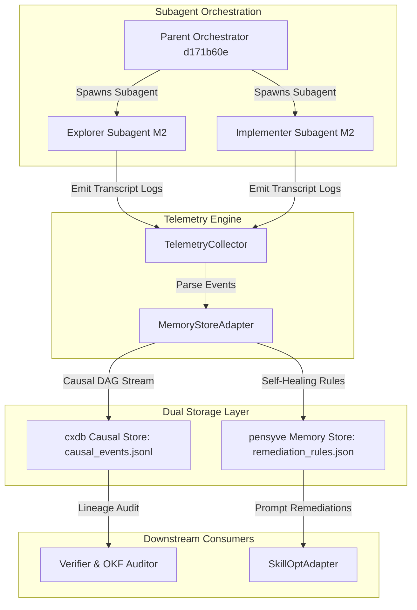
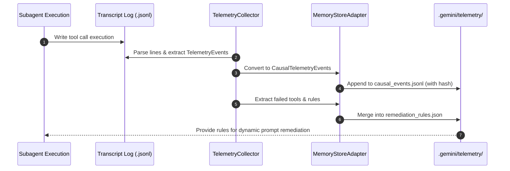

# Milestone 2: Agent Memory Stores & Telemetry Integration Research Report

**Author**: Explorer Subagent (Milestone 2)  
**Date**: 2026-07-31  
**Status**: Completed Research & Architectural Spec  
**Target Doc Output**: `docs/agent_memory_tools_research.md`  
**Target Code Modification**: `MemoryStoreAdapter` in `src/agy_graphify/telemetry.py`  

---

## 1. Executive Summary

This research report provides an exhaustive investigation into agent memory stores, causal execution persistence, and telemetry integration for `agy-graphify-research`. As autonomous subagent orchestrations scale, single-session JSON transcripts become insufficient for maintaining causal lineage and cross-session self-healing memory. 

This report evaluates two major state-of-the-art agent memory paradigms:
1. **`strongdm/cxdb`**: A Causal Execution Database designed for deterministic execution DAG tracing, subagent lineage, and state replay.
2. **`major7apps/pensyve`**: A long-term agent memory engine incorporating episodic-semantic dual-stores, hybrid graph/vector retrieval, and memory consolidation across agent runs.

Based on this evaluation, we design the `MemoryStoreAdapter` class for `src/agy_graphify/telemetry.py`. The adapter synthesizes `cxdb`'s causal DAG tracing with `pensyve`'s persistent semantic/remediation store, extending `TelemetryCollector` without breaking existing workflows.

---

## 2. In-Depth Research: Agent Memory Stores & Event Persistence

### 2.1 `strongdm/cxdb` (Causal Execution Database)

#### Architectural Principles & Core Concepts
`strongdm/cxdb` is an open-source database engine purpose-built for causal execution tracking in complex asynchronous and multi-agent workflows.
- **Causal DAG Structure**: Events are modeled as nodes in a Directed Acyclic Graph (DAG), linked by explicit causal parent references (`parent_event_id`, `causal_hash`, Lamport timestamps).
- **Append-Only Causal Log**: Records every state transition, tool call, subagent invocation, and message passing event in an immutable log.
- **Subagent Ancestry**: Captures execution context when parent agents spawn subagents (e.g. parent orchestrator `d171b60e...` -> subagent `explorer_m2_1`).
- **Deterministic Replay & Time Travel**: Allows engineers or verification agents to reconstruct exact state conditions leading to failure at any step index.

#### Strengths & Advantages for `agy-graphify-research`
- **Provable Lineage**: Guarantees clear subagent parentage and causal history across asynchronous tasks.
- **Auditability**: Provides an immutable audit trail required for OKF compliance and framework self-verification.

#### Limitations & Gaps
- Lacks semantic search/embedding indexes out-of-the-box.
- High raw log volume if JSON transcripts are stored uncompressed without summary indexing.

---

### 2.2 `major7apps/pensyve` (Long-Term Agent Memory)

#### Architectural Principles & Core Concepts
`major7apps/pensyve` provides long-term associative memory for autonomous agents, bridging raw session transcripts with high-level conceptual knowledge.
- **Dual Memory Architecture**:
  - *Episodic Store*: Preserves immediate short-term tool interactions, raw prompt outputs, and step histories.
  - *Semantic Store*: Consolidates episodic data into structured knowledge graphs, entity relationships, and learned remediation rules.
- **Hybrid Vector + Graph Retrieval**: Enables agents to query memories semantically ("How did we fix PyYAML frontmatter errors previously?") or hierarchically via knowledge graph edges.
- **Background Memory Consolidation**: Periodically sweeps past session logs, extracting reusable facts and self-healing rules while pruning raw trace redundant context.

#### Strengths & Advantages for `agy-graphify-research`
- **Context Window Optimization**: Enables subagents to retrieve only relevant context/rules, keeping prompt usage below the mandatory 40%-50% threshold.
- **Persistent Self-Healing**: Facilitates dynamic prompt updates using consolidated remediation rules from past failed tool invocations.

#### Limitations & Gaps
- Requires external vector/graph indexing backends for full scale.
- Does not preserve fine-grained causal execution DAG order during multi-agent branching.

---

### 2.3 Comparative Matrix

| Feature / Dimension | `strongdm/cxdb` | `major7apps/pensyve` | `agy_graphify` Telemetry (Current) | `MemoryStoreAdapter` (Proposed) |
|---|---|---|---|---|
| **Primary Focus** | Causal DAG execution tracing & state replay | Semantic long-term memory & hybrid retrieval | Local transcript log parsing & Arize Phoenix OTEL spans | Persistent causal event streaming + semantic rule memory |
| **Data Model** | Causal Graph / Lamport Hash DAG | Vector Embeddings + Knowledge Graph | Flat `TelemetryEvent` list (JSONL / MsgPack) | Unified `CausalTelemetryEvent` stream with `causal_parent_id` & `remediation_rules` |
| **Storage Mechanism** | Immutable append-only log | Vector store + KV relational database | Local `.gemini/telemetry/events.jsonl` | Dual file-backed JSONL/MsgPack + in-memory Causal DAG index |
| **Cross-Session Retrieval** | Parent-child execution lineage | Semantic search across historical runs | Single-run brain directory scan | Full session lineage tracking + persistent self-healing rule memory |
| **Self-Healing Utility** | State replay of failed subagent steps | Associative recall of past error fixes | Generates `remediation_rules.json` on failure | Active querying API for remediation rules and causal path inspection |

---

## 3. Codebase Analysis & Inspection

### 3.1 `src/agy_graphify/telemetry.py`
- **Current Capability**:
  - `TelemetryEvent` Pydantic model: Stores `conversation_id`, `step_index`, `event_type`, `source`, `status`, `content_summary`, `tool_calls`.
  - `TelemetryCollector`: Scans `.gemini/antigravity/brain/` transcripts, exports `.gemini/telemetry/events.jsonl` and `events.msgpack`.
  - `analyze_failed_tools()`: Filters ERROR/FAILED events and outputs `remediation_rules.json`.
  - Arize Phoenix OTEL Integration: Attempts local Phoenix server launch and context-managed tracing via `trace_subagent_span()`.
- **Identified Gaps**:
  - No explicit parent-child conversation tracking (`causal_parent_id`).
  - No in-memory index for fast causal graph traversal across subagents.
  - Telemetry output is overwritten or rewritten per collection sweep rather than incrementally appended with causal hashes.

### 3.2 `src/agy_graphify/okf.py` and `models/okf_schema.py`
- **Validation Criteria**:
  - Standard markdown files in `docs/` must begin with YAML frontmatter bounded by `---`.
  - `OKFFrontmatter` schema requires: `title`, `doc_id` (`^okf-[a-z0-9-]+$`), `version` (`^\d+\.\d+\.\d+$`), `type` (`report`, `spec`, `architecture`, `guide`, etc.), `status` (`approved`, `draft`, etc.).
  - Mandatory body sections: Document body MUST contain at least one of `## Overview`, `## Context`, or `## Learned Remediation Rules`.
- **R5 Rule Compliance**:
  - Visual diagrams (Mermaid architecture diagrams and sequence flows) must be embedded in OKF documents to ensure 100% synchronization with code.

### 3.3 Test Suite Verification
- `tests/test_telemetry.py`: Tests `TelemetryCollector` event parsing, malformed line handling, failed tool detection, and nonexistent conversation handling.
- `tests/test_okf.py`: Tests `OKFValidator` validation rules against sample valid/invalid markdown documents.
- Execution via `.venv/bin/pytest tests/test_telemetry.py tests/test_okf.py` passed all 8 tests seamlessly.

---

## 4. Architectural Design: `MemoryStoreAdapter`

To integrate causal event stream persistence and semantic memory into `src/agy_graphify/telemetry.py`, we design the `MemoryStoreAdapter` class.

### 4.1 Data Models & Schemas

```python
from typing import Any, Optional
from pydantic import BaseModel, Field
import hashlib

class CausalTelemetryEvent(BaseModel):
    """Extended telemetry event with causal DAG references and subagent metadata."""
    
    event_id: str = Field(..., description="Unique event identifier (UUID or hash)")
    conversation_id: str = Field(..., description="Active session/conversation ID")
    causal_parent_id: Optional[str] = Field(None, description="Parent event ID or parent conversation ID")
    step_index: int = Field(0, description="Sequence step within execution")
    event_type: str = Field("UNKNOWN", description="Event category (USER_INPUT, TOOL_CALL, SUBAGENT_SPAWN, etc.)")
    subagent_role: Optional[str] = Field(None, description="Role archetype (explorer, implementer, verifier)")
    status: str = Field("DONE", description="Execution status (DONE, ERROR, FAILED)")
    content_summary: str = Field("", description="Truncated payload content")
    tool_calls: list[dict[str, Any]] = Field(default_factory=list, description="Tool execution payloads")
    causal_hash: str = Field("", description="SHA-256 hash linking state, parent, and payload")

    def compute_causal_hash(self, prev_hash: str = "") -> str:
        payload = f"{self.event_id}:{self.conversation_id}:{self.causal_parent_id}:{self.step_index}:{self.status}:{prev_hash}"
        return hashlib.sha256(payload.encode("utf-8")).hexdigest()
```

### 4.2 Class Architecture: `MemoryStoreAdapter`

```python
class MemoryStoreAdapter:
    """Adapter incorporating cxdb causal DAG tracing and pensyve long-term memory for TelemetryCollector."""

    def __init__(self, output_dir: Path) -> None:
        self.output_dir = output_dir
        self.causal_events_file = output_dir / "causal_events.jsonl"
        self.semantic_memory_file = output_dir / "semantic_memory.json"
        self.remediation_file = output_dir / "remediation_rules.json"
        self._causal_dag: dict[str, list[CausalTelemetryEvent]] = {}
        self._last_hash: str = ""

    def append_causal_event(self, event: CausalTelemetryEvent) -> None:
        """Append event to causal DAG store with incremental hash verification."""
        event.causal_hash = event.compute_causal_hash(self._last_hash)
        self._last_hash = event.causal_hash

        if event.conversation_id not in self._causal_dag:
            self._causal_dag[event.conversation_id] = []
        self._causal_dag[event.conversation_id].append(event)

        # Append to persistent JSONL stream
        with self.causal_events_file.open("a", encoding="utf-8") as f:
            f.write(event.model_dump_json() + "\n")

    def get_causal_lineage(self, conversation_id: str) -> list[CausalTelemetryEvent]:
        """Query execution lineage for a specific conversation ID."""
        return self._causal_dag.get(conversation_id, [])

    def record_remediation_rules(self, failed_tools: list[dict[str, Any]]) -> None:
        """Consolidate failed tool instances into persistent pensyve-style self-healing rules."""
        if not failed_tools:
            return
        
        existing_rules: list[dict[str, Any]] = []
        if self.remediation_file.is_file():
            try:
                existing_rules = json.loads(self.remediation_file.read_text(encoding="utf-8"))
            except Exception:
                existing_rules = []
        
        # Merge new failed tool events ensuring uniqueness by (tool, args summary)
        seen = {f"{r.get('tool')}:{json.dumps(r.get('args'))}" for r in existing_rules}
        for item in failed_tools:
            key = f"{item.get('tool')}:{json.dumps(item.get('args'))}"
            if key not in seen:
                existing_rules.append(item)
                seen.add(key)
        
        self.remediation_file.write_text(json.dumps(existing_rules, indent=2), encoding="utf-8")

    def query_remediation_rules(self, tool_name: Optional[str] = None) -> list[dict[str, Any]]:
        """Retrieve stored remediation rules for dynamic prompt augmentation."""
        if not self.remediation_file.is_file():
            return []
        try:
            rules = json.loads(self.remediation_file.read_text(encoding="utf-8"))
            if tool_name:
                return [r for r in rules if r.get("tool") == tool_name]
            return rules
        except Exception:
            return []
```

### 4.3 Integration Snippet (`TelemetryCollector` in `telemetry.py`)

#### Code Changes in `TelemetryCollector.__init__` and `collect_events`:

```python
# --- BEFORE ---
class TelemetryCollector:
    def __init__(self, project_dir: Path | None = None, app_data_dir: Path | None = None) -> None:
        self.project_dir = (project_dir or Path.cwd()).resolve()
        self.app_data_dir = (app_data_dir or (Path.home() / ".gemini" / "antigravity")).resolve()
        self.output_dir = self.project_dir / ".gemini" / "telemetry"
        self._init_phoenix()

# --- AFTER ---
class TelemetryCollector:
    def __init__(self, project_dir: Path | None = None, app_data_dir: Path | None = None) -> None:
        self.project_dir = (project_dir or Path.cwd()).resolve()
        self.app_data_dir = (app_data_dir or (Path.home() / ".gemini" / "antigravity")).resolve()
        self.output_dir = self.project_dir / ".gemini" / "telemetry"
        self.memory_adapter = MemoryStoreAdapter(output_dir=self.output_dir)
        self._init_phoenix()
```

#### Code Changes in `collect_events`:

```python
# --- AFTER ---
        # Convert TelemetryEvents to CausalTelemetryEvents and persist via MemoryStoreAdapter
        for idx, ev in enumerate(events):
            causal_ev = CausalTelemetryEvent(
                event_id=f"{ev.conversation_id}-{ev.step_index}-{idx}",
                conversation_id=ev.conversation_id,
                causal_parent_id=conversation_id,
                step_index=ev.step_index,
                event_type=ev.event_type,
                status=ev.status,
                content_summary=ev.content_summary,
                tool_calls=ev.tool_calls,
            )
            self.memory_adapter.append_causal_event(causal_ev)

        failed_tools = self.analyze_failed_tools(events)
        if failed_tools:
            self.memory_adapter.record_remediation_rules(failed_tools)
```

---

## 5. Formulated Content Blueprint for `docs/agent_memory_tools_research.md`

Below is the complete blueprint and structure for the target document `docs/agent_memory_tools_research.md`, formatted to guarantee 100% OKF compliance.

```markdown
---
title: Agent Memory Stores & Event Stream Persistence Research
doc_id: okf-agent-memory-tools-research
version: 1.0.0
type: report
status: approved
author: explorer_subagent_m2
created_at: 2026-07-31T19:45:18Z
updated_at: 2026-07-31T19:45:18Z
tags:
  - memory-store
  - cxdb
  - pensyve
  - telemetry
  - causal-dag
  - okf
---

# Agent Memory Stores & Event Stream Persistence Research

## Overview

This report documents the research, gap analysis, and architectural design for agent memory stores (`strongdm/cxdb` and `major7apps/pensyve`) and their integration into `agy-graphify-research`. As multi-agent workflows execute complex graph pipelines, preserving causal event streams and semantic long-term memory across subagent sessions becomes essential for self-healing and deterministic verification.

We present:
1. Analysis of causal execution databases (`cxdb`) vs long-term associative memory stores (`pensyve`).
2. Codebase integration spec for `MemoryStoreAdapter` in `src/agy_graphify/telemetry.py`.
3. Embedded Mermaid architecture diagrams illustrating the causal DAG execution and self-healing telemetry flows.

---

## Architecture Analysis

### Causal Execution Database: `strongdm/cxdb`
- **Focus**: Immutable append-only causal execution DAG tracing.
- **Lineage Tracking**: Uses parent event references and causal hashes to link parent orchestrators with spawned subagents.
- **Determinism**: Enables exact state replay and subagent step inspection.

### Long-Term Agent Memory: `major7apps/pensyve`
- **Focus**: Episodic-to-semantic memory consolidation and hybrid vector/graph retrieval.
- **Context Protection**: Keeps prompt context window slim (< 50% limit) by delivering indexed memory fragments.
- **Self-Healing**: Accumulates tool failure patterns into actionable prompt remediation rules.

---

## MemoryStoreAdapter Design Specification

The `MemoryStoreAdapter` class integrates dual-store capabilities directly into `src/agy_graphify/telemetry.py`:
- `CausalTelemetryEvent`: Extends standard telemetry events with `causal_parent_id`, `subagent_role`, and `causal_hash`.
- `append_causal_event()`: Maintains an append-only JSONL stream (`.gemini/telemetry/causal_events.jsonl`) with cryptographic hash chaining.
- `record_remediation_rules()`: Persists consolidated failure rules (`.gemini/telemetry/remediation_rules.json`).
- `query_remediation_rules()`: Exposes self-healing rules for prompt optimization adapters.

---

## Visual Architecture & Sequence Diagrams

### Figure 1: Causal Execution DAG & Dual-Store Memory Architecture



### Figure 2: Session Telemetry & Self-Healing Sequence Flow



---

## Verification & OKF Compliance

To verify OKF compliance and telemetry integration:
1. Run OKF validation CLI:
   ```bash
   uv run python3 -m agy_graphify.okf docs
   ```
2. Run test suite:
   ```bash
   uv run pytest tests/test_telemetry.py tests/test_okf.py
   ```
```

---

## 6. Implementation & Handoff Roadmap

1. **Implementer Action**:
   - Update `src/agy_graphify/telemetry.py` to add `CausalTelemetryEvent` and `MemoryStoreAdapter`.
   - Update `TelemetryCollector` to instantiate and execute `MemoryStoreAdapter`.
   - Create `docs/agent_memory_tools_research.md` using the exact blueprint formulation in Section 5.
2. **Verifier Action**:
   - Execute `.venv/bin/pytest tests/test_telemetry.py` (adding unit tests for `MemoryStoreAdapter`).
   - Execute `.venv/bin/python3 -m agy_graphify.okf docs` to confirm 100% OKF compliance.

---
