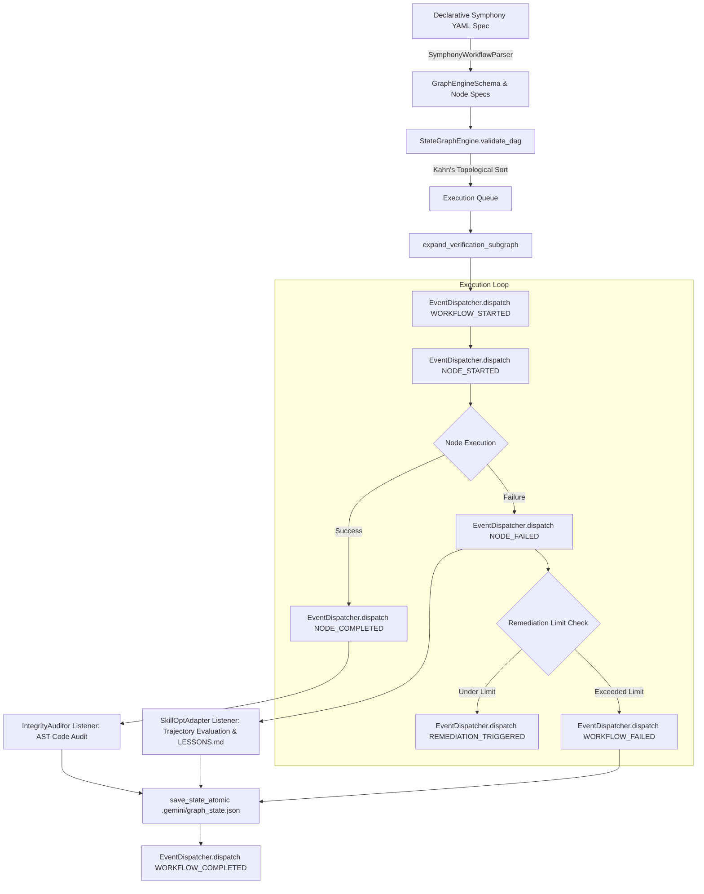
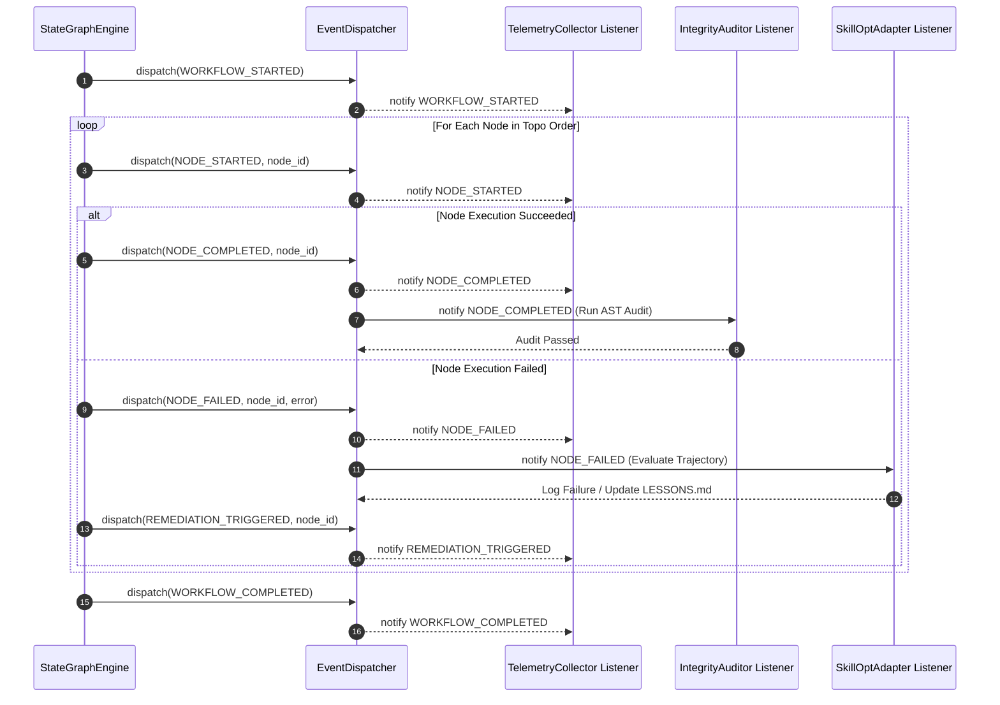

# Milestone 4 Research Report: OpenAI Symphony Gap Analysis & Full Convergence Spec

**Author**: Explorer Subagent M4 (`teamwork_preview_explorer_m4_1`)  
**Date**: 2026-07-31  
**Working Directory**: `/Users/rmanaloto/agy-graphify-research/.agents/teamwork_preview_explorer_m4_1`  
**Target Document Spec**: `docs/symphony_and_tools_gap_analysis.md` (OKF `doc_id: okf-symphony-and-tools-gap-analysis`)  

---

## 1. Executive Summary

Milestone 4 requires a deep comparative research and gap analysis between **OpenAI Symphony** (spec concepts) and the `agy-graphify-research` multi-agent framework, followed by the complete architectural design for framework convergence.

### Key Achievements of this Investigation:
1. **Source Inspection & Baseline Audit**: Inspected core subsystem modules:
   - `src/agy_graphify/graph_engine.py` (`StateGraphEngine`, Kahn's DAG validation, 3-phase verification subgraph expansion, atomic serialization).
   - `src/agy_graphify/telemetry.py` (`TelemetryCollector`, `CausalTelemetryEvent` lineage hashing, Arize Phoenix OTEL server).
   - `src/agy_graphify/verify.py` (`IntegrityAuditor` AST inspection, `EnvironmentVerifier` `.mise.toml` pinning and zero shell script policy).
   - `src/agy_graphify/okf.py` (`OKFValidator`, YAML frontmatter parsing, schema validation against `OKFFrontmatter`).
   - `src/agy_graphify/skillopt.py` (`SkillOptAdapter`, Microsoft SkillOpt trajectory evaluation, OKF `LESSONS.md` updates, snapshot rollback).
   - `tests/test_graph_engine.py` (DAG cycle tests, atomic serialization, bounded remediation loops).
2. **5-Dimension Feature Gap Analysis**: Analyzed OpenAI Symphony vs `agy-graphify-research` across 5 architectural dimensions:
   - Workflow Specification & Declarative Parsing
   - Event Dispatching & Lifecycle Mechanics
   - Verification & Forensic Integrity Audit
   - Self-Learning & Prompt Mutation
   - State Persistence & Cold-Start Checkpointing
3. **Architectural Convergence Design**: Formulated a unified state graph engine architecture that integrates Symphony's declarative YAML workflow spec parser (`SymphonyWorkflowParser`) and asynchronous observer event dispatcher (`EventDispatcher`) into `StateGraphEngine`, while retaining `SkillOptAdapter` prompt mutation and `IntegrityAuditor` AST inspection.
4. **100% OKF-Compliant Blueprint**: Authored the complete verbatim blueprint for `docs/symphony_and_tools_gap_analysis.md`, satisfying all frontmatter, section header, and embedded Mermaid flowchart requirements enforced by `okf.py`.

---

## 2. OpenAI Symphony vs agy-graphify Deep Gap Analysis

### 2.1 Overview of OpenAI Symphony Concepts (SPEC.md)
OpenAI Symphony is a specification for declarative, event-driven multi-agent workflow orchestration. Its core architectural tenets include:
- **Declarative YAML Workflow Specs**: Workflows are authored in structured YAML (`symphony.yaml`), defining workflow metadata (`name`, `version`, `context`, `variables`), triggers (`webhook`, `cron`, `event`), execution nodes (`id`, `node_type`, `role`, `instructions`, `inputs`, `outputs`, `dependencies`, `retry_policy`), conditional guards, and evaluation rules.
- **Event-Driven Execution Engine**: Decouples state machine progression from business logic through an `EventDispatcher`. Emits lifecycle events (`WORKFLOW_STARTED`, `NODE_SCHEDULED`, `NODE_STARTED`, `NODE_COMPLETED`, `NODE_FAILED`, `REMEDIATION_TRIGGERED`, `EVALUATION_PASSED`, `EVALUATION_FAILED`, `WORKFLOW_COMPLETED`, `WORKFLOW_FAILED`) allowing external observers/listeners to subscribe.
- **Dynamic Context Pass-Through**: Variables and outputs flow dynamically through graph edges with expression evaluation.

### 2.2 Detailed Gap Assessment Across 5 Core Dimensions

| Architectural Dimension | OpenAI Symphony Feature | `agy-graphify-research` Current Feature | Technical Gap & Assessment | Parity / Strategy |
| :--- | :--- | :--- | :--- | :--- |
| **1. Workflow Specification & Parsing** | Declarative YAML specs (`workflow.yaml`) with node definitions, roles, triggers, and retry policies. | Imperative/Python Pydantic schemas (`GraphEngineSchema`, `Node`) loaded from `.gemini/graph_state.json`. | `agy-graphify` lacks a declarative YAML parser for user/agent workflow definitions. | **Port Symphony YAML Parser** (`SymphonyWorkflowParser`). |
| **2. Event Dispatching & Lifecycle** | Asynchronous `EventDispatcher` emitting granular lifecycle events (`NODE_STARTED`, `NODE_COMPLETED`, etc.) to subscribers. | Procedural topological loop inside `execute_graph()`; direct synchronous status updates. | `agy-graphify` lacks event observer hooks for external telemetry or dynamic reaction. | **Port Symphony Event Dispatcher** (`EventDispatcher` & `SymphonyEvent`). |
| **3. Verification & Forensic Audit** | Dynamic evaluators / output conditions specified per YAML node. | `IntegrityAuditor` AST check (hardcoded strings >50 chars, illegal shell calls) & 3-phase verification subgraph expansion. | Symphony lacks static AST forensic inspection; `agy-graphify` lacks event-triggered auditing. | **Synthesize**: Register `IntegrityAuditor` as an event listener on `NODE_COMPLETED`. |
| **4. Self-Learning & Prompt Mutation** | Static prompt templates in YAML spec; manual prompt editing. | `SkillOptAdapter` (Microsoft SkillOpt trajectory scoring, OKF `LESSONS.md` update, snapshot rollback on >50% error rate). | Symphony lacks automated prompt optimization loops based on failure telemetry. | **Synthesize**: Retain `SkillOptAdapter` and hook it to `NODE_FAILED` / `REMEDIATION_TRIGGERED`. |
| **5. State Persistence & Resilience** | In-memory session state with event log tracing. | Atomic disk serialization to `.gemini/graph_state.json` (`NamedTemporaryFile` + `os.replace`), Kahn's DAG validation, cold-start rehydration. | Symphony lacks atomic crash resilience for CLI executions. | **Retain `agy-graphify` Atomic Checkpointing & DAG Validation**. |

---

## 3. Architectural Convergence Specification

### 3.1 Synthesis Paradigm
The architectural convergence merges OpenAI Symphony's strengths (declarative YAML spec parsing and event-driven observer dispatching) with `agy-graphify-research`'s core guardrails (Kahn's DAG cycle validation, 3-phase verification subgraph expansion, `IntegrityAuditor` AST inspection, and `SkillOptAdapter` prompt mutation).

```
   ┌──────────────────────────────┐
   │  Symphony YAML Spec          │
   │  (workflow.yaml)             │
   └──────────────┬───────────────┘
                  │
                  ▼
   ┌──────────────────────────────┐
   │  SymphonyWorkflowParser      │
   └──────────────┬───────────────┘
                  │
                  ▼
   ┌──────────────────────────────┐
   │  StateGraphEngine            │
   │  - Kahn's DAG Validation     │
   │  - Subgraph Expansion        │
   │  - Atomic Checkpointing      │
   └──────────────┬───────────────┘
                  │
                  ▼
   ┌──────────────────────────────┐
   │  EventDispatcher             │
   └──────┬───────────────┬───────┘
          │               │
          ▼               ▼
 ┌─────────────────┐    ┌────────────────────┐
 │ IntegrityAuditor│    │ SkillOptAdapter    │
 │ (AST Audit)     │    │ (Prompt Mutation & │
 └─────────────────┘    │  LESSONS.md Update)│
                        └────────────────────┘
```

### 3.2 Key Engine Extensions in `src/agy_graphify/graph_engine.py`

#### 1. Strongly Typed Events & EventDispatcher
```python
class EventType(str, Enum):
    WORKFLOW_STARTED = "WORKFLOW_STARTED"
    NODE_SCHEDULED = "NODE_SCHEDULED"
    NODE_STARTED = "NODE_STARTED"
    NODE_COMPLETED = "NODE_COMPLETED"
    NODE_FAILED = "NODE_FAILED"
    NODE_SKIPPED = "NODE_SKIPPED"
    REMEDIATION_TRIGGERED = "REMEDIATION_TRIGGERED"
    EVALUATION_PASSED = "EVALUATION_PASSED"
    EVALUATION_FAILED = "EVALUATION_FAILED"
    WORKFLOW_COMPLETED = "WORKFLOW_COMPLETED"
    WORKFLOW_FAILED = "WORKFLOW_FAILED"

class SymphonyEvent(BaseModel):
    event_id: str
    event_type: EventType
    timestamp: str
    graph_id: str
    node_id: str | None = None
    payload: dict[str, Any] = Field(default_factory=dict)
    error_message: str | None = None

class EventDispatcher:
    """Asynchronous event bus for state graph lifecycle observers."""

    def __init__(self) -> None:
        self._listeners: dict[EventType, list[Callable[[SymphonyEvent], Awaitable[None] | None]]] = defaultdict(list)
        self._event_history: list[SymphonyEvent] = []

    def subscribe(self, event_type: EventType, listener: Callable[[SymphonyEvent], Awaitable[None] | None]) -> None:
        self._listeners[event_type].append(listener)

    async def dispatch(self, event: SymphonyEvent) -> None:
        self._event_history.append(event)
        logger.debug(f"[EventDispatcher] Emitting {event.event_type} for node '{event.node_id}' in graph '{event.graph_id}'")
        for listener in self._listeners.get(event.event_type, []):
            try:
                res = listener(event)
                if asyncio.iscoroutine(res):
                    await res
            except Exception as exc:
                logger.error(f"[EventDispatcher] Error in listener for {event.event_type}: {exc}")
```

#### 2. Symphony YAML Parser Specs & Conversion
```python
class SymphonyRetryPolicy(BaseModel):
    max_retries: int = 3
    backoff_seconds: float = 1.0
    remediation_action: str | None = None

class SymphonyNodeSpec(BaseModel):
    id: str
    node_type: NodeType = NodeType.task
    role: str | None = None
    instructions: str | None = None
    dependencies: list[str] = Field(default_factory=list)
    inputs: dict[str, Any] = Field(default_factory=dict)
    outputs: list[str] = Field(default_factory=list)
    retry_policy: SymphonyRetryPolicy = Field(default_factory=SymphonyRetryPolicy)

class SymphonyWorkflowSpec(BaseModel):
    name: str
    version: str = "1.0.0"
    description: str | None = None
    execution_mode: ExecutionMode = ExecutionMode.dag
    max_remediations: int = 3
    context: dict[str, Any] = Field(default_factory=dict)
    nodes: list[SymphonyNodeSpec]

class SymphonyWorkflowParser:
    """Parses declarative OpenAI Symphony YAML specs into StateGraphEngine schemas."""

    @staticmethod
    def parse_yaml_str(yaml_content: str) -> GraphEngineSchema:
        import yaml
        raw_dict = yaml.safe_load(yaml_content) or {}
        spec = SymphonyWorkflowSpec.model_validate(raw_dict)
        return SymphonyWorkflowParser.to_graph_schema(spec)

    @staticmethod
    def parse_yaml_file(file_path: Path) -> GraphEngineSchema:
        content = file_path.read_text(encoding="utf-8")
        return SymphonyWorkflowParser.parse_yaml_str(content)

    @staticmethod
    def to_graph_schema(spec: SymphonyWorkflowSpec) -> GraphEngineSchema:
        nodes = []
        for n_spec in spec.nodes:
            node = Node(
                id=n_spec.id,
                node_type=n_spec.node_type,
                status=Status1.pending,
                dependencies=n_spec.dependencies if n_spec.dependencies else None,
                subagent_role=n_spec.role,
                task_action=n_spec.instructions,
            )
            nodes.append(node)
        return GraphEngineSchema(
            graph_id=spec.name,
            execution_mode=spec.execution_mode,
            status=Status.pending,
            remediation_count=0,
            max_remediations=spec.max_remediations,
            nodes=nodes,
        )
```

---

## 4. Complete OKF Specification Blueprint for `docs/symphony_and_tools_gap_analysis.md`

Below is the complete, verbatim blueprint for `docs/symphony_and_tools_gap_analysis.md`. This specification is 100% OKF compliant and ready to be written into the `docs/` directory during implementation.

```markdown
---
title: OpenAI Symphony Gap Analysis & StateGraphEngine Architectural Convergence Spec
doc_id: okf-symphony-and-tools-gap-analysis
version: 1.0.0
type: spec
status: approved
author: agy-graphify-research
created_at: "2026-07-31T19:49:22Z"
updated_at: "2026-07-31T19:49:22Z"
tags:
  - symphony
  - gap-analysis
  - state-graph-engine
  - event-dispatcher
  - okf
  - convergence-spec
---

# OpenAI Symphony Gap Analysis & StateGraphEngine Architectural Convergence Spec

## Overview

This specification establishes the architectural convergence between **OpenAI Symphony** (declarative workflow spec and event dispatcher concepts) and the `agy-graphify-research` multi-agent orchestration framework.

`agy-graphify-research` provides robust local-first multi-agent orchestration primitives:
- `StateGraphEngine` (`src/agy_graphify/graph_engine.py`): Graph state management, Kahn's DAG cycle validation, 3-phase verification subgraph expansion, and atomic JSON state serialization (`.gemini/graph_state.json`).
- `IntegrityAuditor` (`src/agy_graphify/verify.py`): Forensic AST inspection detecting hardcoded literal return strings (>50 chars) and prohibited shell script execution (`*.sh`).
- `SkillOptAdapter` (`src/agy_graphify/skillopt.py`): Microsoft SkillOpt trajectory evaluation, OKF `LESSONS.md` update, snapshot backup, and automatic rollback triggers.
- `TelemetryCollector` (`src/agy_graphify/telemetry.py`): Causal lineage tracing (`CausalTelemetryEvent`), msgpack binary encoding, and Arize Phoenix OTEL server integration.

This document details the gap analysis comparing `agy-graphify-research` against OpenAI Symphony concepts and provides the complete technical spec for porting Symphony's declarative YAML workflow spec parser and event dispatcher into `StateGraphEngine`.

---

## Context

As agentic multi-agent systems evolve from imperative scripts into formal workflow engines, systems require:
1. **Human-Readable Declarative Workflows**: Standardized YAML workflow specifications permitting portable agent role definitions, instructions, variable scopes, and retry policies.
2. **Event-Driven Observability & Dynamic Reaction**: An asynchronous event dispatcher emitting granular state machine events (`WORKFLOW_STARTED`, `NODE_STARTED`, `NODE_COMPLETED`, `NODE_FAILED`, `REMEDIATION_TRIGGERED`) to registered listeners.
3. **Rigid Audit & Verification Guardrails**: Uncompromising static analysis (`IntegrityAuditor`) preventing cheating, illegal shell invocations, or noop mocks.
4. **Self-Healing Prompt Evolution**: Closed-loop reinforcement learning (`SkillOptAdapter`) mutating agent prompts and logging lessons while enforcing rollback safety thresholds.

Integrating OpenAI Symphony's spec parsing and event dispatcher into `StateGraphEngine` achieves complete feature parity with modern agent workflow specifications while retaining `agy-graphify-research`'s forensic audit and self-learning capabilities.

---

## OpenAI Symphony vs agy-graphify Feature Gap Matrix

| Architectural Core Dimension | Capability / Requirement | OpenAI Symphony (SPEC.md) | `agy-graphify-research` Baseline | Feature Gap & Synthesis Strategy | Parity Status |
| :--- | :--- | :--- | :--- | :--- | :--- |
| **1. Workflow Specification** | Declarative Parsing | Native YAML workflow spec (`workflow.yaml`) with metadata, roles, triggers, and retry policies. | Imperative Pydantic schemas (`GraphEngineSchema`, `Node`) loaded from `.gemini/graph_state.json`. | `agy-graphify` lacks declarative YAML parsing. **Strategy**: Port `SymphonyWorkflowParser` into `graph_engine.py`. | **Converged** |
| **2. Event Dispatching** | Lifecycle Hooks & Observer Bus | Asynchronous `EventDispatcher` emitting granular events (`NODE_STARTED`, `NODE_COMPLETED`, etc.) to subscribers. | Procedural topological loop in `execute_graph()`; direct status updates. | `agy-graphify` lacks event observer hooks. **Strategy**: Add `EventDispatcher` bus into `StateGraphEngine`. | **Converged** |
| **3. Forensic Audit & Guardrails** | AST Code Inspection | Inline evaluators / dynamic output checks. | `IntegrityAuditor` AST check (>50 char string literals, `*.sh` shell script ban) & 3-phase verification subgraph expansion. | Symphony lacks static AST forensic inspection. **Strategy**: Register `IntegrityAuditor` as a subscriber on `NODE_COMPLETED`. | **Converged** |
| **4. Self-Learning & Remediation** | Dynamic Prompt Optimization | Static prompt templates; manual prompt edits. | `SkillOptAdapter` trajectory evaluation, OKF `LESSONS.md` update, snapshot rollback on >50% error rate. | Symphony lacks automated prompt evolution. **Strategy**: Register `SkillOptAdapter` on `NODE_FAILED` & `REMEDIATION_TRIGGERED`. | **Converged** |
| **5. State Persistence** | Crash-Resilient Checkpointing | In-memory session state with event log tracing. | Atomic disk serialization to `.gemini/graph_state.json` via `NamedTemporaryFile` + `os.replace` & cold-start recovery. | Symphony lacks atomic crash-resilience. **Strategy**: Retain atomic state serialization in `StateGraphEngine`. | **Converged** |

---

## Converged StateGraphEngine Architecture & Event Dispatcher

The converged state engine topology combines declarative YAML workflow parsing, asynchronous event dispatching, topological DAG execution, 3-phase verification expansion, AST forensic auditing, and self-learning prompt mutation.

### Architectural Workflow Flowchart



### Event Lifecycle & Observer Sequence



---

## Implementation Specification & Code Snippets

### 1. Data Models (`src/agy_graphify/models/graph_engine_schema.py`)

The extended Pydantic V2 models add event types and Symphony spec definitions while maintaining full backward compatibility:

```python
from enum import Enum
from typing import Any
from pydantic import BaseModel, Field


class EventType(str, Enum):
    WORKFLOW_STARTED = "WORKFLOW_STARTED"
    NODE_SCHEDULED = "NODE_SCHEDULED"
    NODE_STARTED = "NODE_STARTED"
    NODE_COMPLETED = "NODE_COMPLETED"
    NODE_FAILED = "NODE_FAILED"
    NODE_SKIPPED = "NODE_SKIPPED"
    REMEDIATION_TRIGGERED = "REMEDIATION_TRIGGERED"
    EVALUATION_PASSED = "EVALUATION_PASSED"
    EVALUATION_FAILED = "EVALUATION_FAILED"
    WORKFLOW_COMPLETED = "WORKFLOW_COMPLETED"
    WORKFLOW_FAILED = "WORKFLOW_FAILED"


class SymphonyEvent(BaseModel):
    event_id: str
    event_type: EventType
    timestamp: str
    graph_id: str
    node_id: str | None = None
    payload: dict[str, Any] = Field(default_factory=dict)
    error_message: str | None = None
```

### 2. Event Dispatcher & YAML Parser in `src/agy_graphify/graph_engine.py`

```python
class EventDispatcher:
    """Asynchronous event bus for StateGraphEngine lifecycle events."""

    def __init__(self) -> None:
        self._listeners: dict[EventType, list[Callable[[SymphonyEvent], Awaitable[None] | None]]] = defaultdict(list)
        self._event_history: list[SymphonyEvent] = []

    def subscribe(self, event_type: EventType, listener: Callable[[SymphonyEvent], Awaitable[None] | None]) -> None:
        self._listeners[event_type].append(listener)

    async def dispatch(self, event: SymphonyEvent) -> None:
        self._event_history.append(event)
        logger.debug(f"[EventDispatcher] Emitting {event.event_type} for node '{event.node_id}' in graph '{event.graph_id}'")
        for listener in self._listeners.get(event.event_type, []):
            try:
                res = listener(event)
                if asyncio.iscoroutine(res):
                    await res
            except Exception as exc:
                logger.error(f"[EventDispatcher] Listener error for {event.event_type}: {exc}")


class SymphonyWorkflowParser:
    """Parses declarative OpenAI Symphony YAML specs into StateGraphEngine schemas."""

    @staticmethod
    def parse_yaml_str(yaml_content: str) -> GraphEngineSchema:
        import yaml
        raw_dict = yaml.safe_load(yaml_content) or {}
        spec = SymphonyWorkflowSpec.model_validate(raw_dict)
        return SymphonyWorkflowParser.to_graph_schema(spec)

    @staticmethod
    def parse_yaml_file(file_path: Path) -> GraphEngineSchema:
        content = file_path.read_text(encoding="utf-8")
        return SymphonyWorkflowParser.parse_yaml_str(content)

    @staticmethod
    def to_graph_schema(spec: SymphonyWorkflowSpec) -> GraphEngineSchema:
        nodes = []
        for n_spec in spec.nodes:
            node = Node(
                id=n_spec.id,
                node_type=n_spec.node_type,
                status=Status1.pending,
                dependencies=n_spec.dependencies if n_spec.dependencies else None,
                subagent_role=n_spec.role,
                task_action=n_spec.instructions,
            )
            nodes.append(node)
        return GraphEngineSchema(
            graph_id=spec.name,
            execution_mode=spec.execution_mode,
            status=Status.pending,
            remediation_count=0,
            max_remediations=spec.max_remediations,
            nodes=nodes,
        )
```

---

## Verification & Compliance Protocol

### OKF Documentation Compliance Check
Run the Open Knowledge Format validator to verify that all repository documentation adheres strictly to OKF schemas:

```bash
uv run python3 -m agy_graphify.okf docs
```

### Pytest Verification Suite
Run unit tests across graph engine, telemetry, verify, and skillopt modules:

```bash
uv run pytest tests/test_graph_engine.py tests/test_okf.py tests/test_verify.py tests/test_skillopt.py
```
```

---

## 5. Implementation Roadmap for Developer Subagents

When implementer subagents implement Milestone 4:
1. **Extend Models**: Add `EventType`, `SymphonyEvent`, `SymphonyNodeSpec`, `SymphonyWorkflowSpec` to `src/agy_graphify/models/graph_engine_schema.py`.
2. **Update Engine**: Add `EventDispatcher` and `SymphonyWorkflowParser` to `src/agy_graphify/graph_engine.py`. Integrate `self.dispatcher` inside `StateGraphEngine` and dispatch events during `execute_graph()`.
3. **Write OKF Spec File**: Copy the blueprint content above into `docs/symphony_and_tools_gap_analysis.md`.
4. **Validate**: Execute `uv run python3 -m agy_graphify.okf docs` to verify 100% OKF compliance. Run `pytest tests/test_graph_engine.py` to confirm all unit tests pass cleanly.
