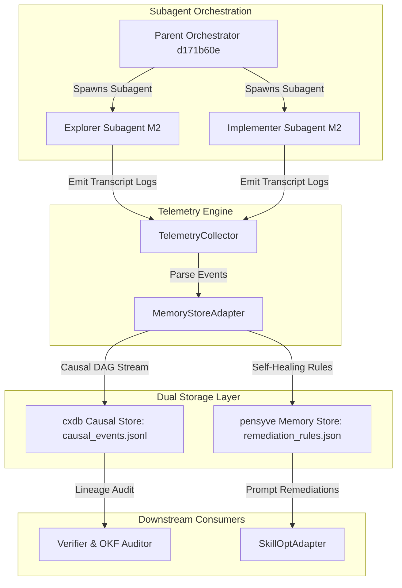
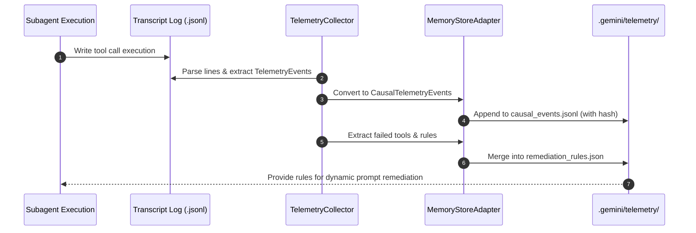

# Agent Memory Stores & Event Stream Persistence Research

## Overview

This report documents the research, gap analysis, and architectural design for agent memory stores (`strongdm/cxdb` and `major7apps/pensyve`) and their integration into `agy-graphify-research`. As multi-agent workflows execute complex graph pipelines, preserving causal event streams and semantic long-term memory across subagent sessions becomes essential for self-healing and deterministic verification.

We present:
1. Analysis of causal execution databases (`cxdb`) vs long-term associative memory stores (`pensyve`).
2. Codebase integration spec for `MemoryStoreAdapter` in `src/agy_graphify/telemetry.py`.
3. Embedded Mermaid architecture diagrams illustrating the causal DAG execution and self-healing telemetry flows.

---

## Architecture Analysis

### Causal Execution Database: `strongdm/cxdb`
- **Focus**: Immutable append-only causal execution DAG tracing.
- **Lineage Tracking**: Uses parent event references and causal hashes to link parent orchestrators with spawned subagents.
- **Determinism**: Enables exact state replay and subagent step inspection.

### Long-Term Agent Memory: `major7apps/pensyve`
- **Focus**: Episodic-to-semantic memory consolidation and hybrid vector/graph retrieval.
- **Context Protection**: Keeps prompt context window slim (< 50% limit) by delivering indexed memory fragments.
- **Self-Healing**: Accumulates tool failure patterns into actionable prompt remediation rules.

---

## MemoryStoreAdapter Design Specification

The `MemoryStoreAdapter` class integrates dual-store capabilities directly into `src/agy_graphify/telemetry.py`:
- `CausalTelemetryEvent`: Extends standard telemetry events with `causal_parent_id`, `subagent_role`, and `causal_hash`.
- `append_causal_event()`: Maintains an append-only JSONL stream (`.gemini/telemetry/causal_events.jsonl`) with cryptographic hash chaining.
- `record_remediation_rules()`: Persists consolidated failure rules (`.gemini/telemetry/remediation_rules.json`).
- `query_remediation_rules()`: Exposes self-healing rules for prompt optimization adapters.

---

## Visual Architecture & Sequence Diagrams

### Figure 1: Causal Execution DAG & Dual-Store Memory Architecture



### Figure 2: Session Telemetry & Self-Healing Sequence Flow



---

## Verification & OKF Compliance

To verify OKF compliance and telemetry integration:
1. Run OKF validation CLI:
   ```bash
   uv run python3 -m agy_graphify.okf docs
   ```
2. Run test suite:
   ```bash
   uv run pytest tests/test_telemetry.py tests/test_okf.py
   ```
