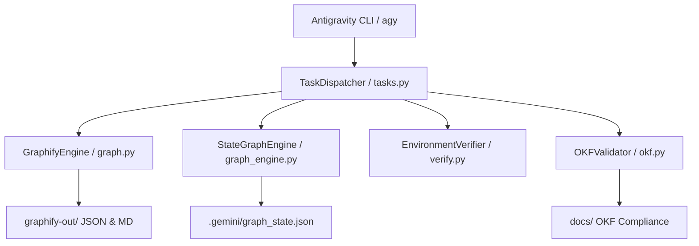

# System Architecture & Design

## Overview

`agy-graphify-research` is a Python library, automation framework, and project plugin providing isolated execution environments, state verification, and persistent knowledge graph extraction for Google Antigravity & Gemini CLI.

## Core Concepts

- **Project Automation Plugin**: Bundles skills, tasks, and rule guardrails into `.gemini/plugins/agy-graphify-research/`.
- **Async Python Library**: Core business logic, knowledge graph extraction (`GraphifyEngine`), multi-agent workflow dispatcher (`OrchestrationEngine`), and environment verifier (`EnvironmentVerifier`).
- **Toolchain Pinning**: Pinned tools (`python 3.14.6`, `uv`, `ruff`, `ty`, `hk`, `fnox`, `pkl`) in `.mise.toml`.

## System Flowchart Architecture

## Relationships & References

- **Mise Task Wrappers**: All skills invoke `mise run <task>` commands.
- **Ruff & Ty Linters**: Code linted with `ruff` (`select = ["ALL"]`) and `ty` strict type checking.
