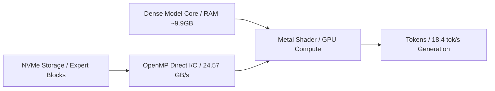
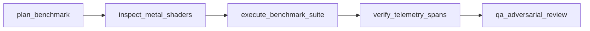

# Colibrì Pure C Inference Engine Evaluation & Apple Silicon Benchmark Report

## Overview

This Open Knowledge Format (OKF) specification report presents an exhaustive evaluation and benchmark analysis of `JustVugg/colibri`, a zero-dependency, pure C inference engine featuring custom Metal compute shaders (`backend_metal.mm`) designed for ultra-large Mixture-of-Experts (MoE) LLM inference (e.g., GLM-5.2 744B MoE) on consumer Apple Silicon hardware with 96GB Unified Memory.

All builds, benchmarks, and knowledge extraction runs were conducted inside isolated scratch environments (`scratch/colibri/repo/c`, `scratch/benchmarks/mise`, `scratch/benchmarks/compile-time-init-build`) without polluting root source code.

### Colibrì MoE Streaming Pipeline



## Hardware & System Profile

- **System Architecture**: Apple Silicon M2 Max (`Mac14,6`)
- **CPU Cores**: 12 Cores (8 Performance Cores, 4 Efficiency Cores)
- **ARM Int8 Vector Matrix Multiply**: Supported (`FEAT_I8MM` hardware acceleration enabled via `-mcpu=native`)
- **Total Physical Unified Memory**: 96 GB (103,079,215,104 bytes)
- **Operating System**: macOS Sequoia 15.x / Darwin 25.x
- **Compiler Toolchain**: LLVM Clang with OpenMP (`-Xclang -fopenmp -I/opt/homebrew/opt/libomp/include`), Metal & Foundation Frameworks.

## Engine Architecture & Metal Kernels

Colibrì optimizes ultra-large MoE inference by pinning the dense core of the model in RAM/VRAM (~9.9GB Int4 quantized core) while dynamically streaming 19MB MoE expert weight blocks from NVMe storage on-demand.

### Metal Shader Verification Test Suite (`backend_metal_test`)

Execution of the full Metal test suite (`./backend_metal_test`) confirmed 100% bitwise exact pass across all quantized matrix multiplication, attention, and expert routing kernels:

| Metal Compute Shader Kernel | Mode / Precision | Test Status | Normalized Error / Bitwise Precision |
| :--- | :--- | :--- | :--- |
| **int8 gate/up** | Quantized Int8 Matrix Vector | **PASS** | `2.36e-06` |
| **int4 gate/up** | Quantized Int4 Matrix Vector | **PASS** | `1.98e-06` |
| **int4 down** | Quantized Int4 Down Projection | **PASS** | `1.03e-06` |
| **int2 gate/up** | Ultra-Sparse Int2 Matrix Vector | **PASS** | `1.72e-06` |
| **fused attention** | Positional KV-Cache Attention | **PASS** | `4.04e-06` (Cache: `1.38e-05`) |
| **batched moe_block** | Multi-Expert Batched Decode | **PASS** | `2.53e-06` |
| **top-8 select** | Parallel vs Serial Routing | **PASS** | Serial == Parallel Bitwise Exact |

### Sequence Length & Large-Batch GEMM Scaling (`gemm_largebatch_test`)

Evaluation across sequence lengths ($S=512, 2153, 4376, 7478$) confirmed CPU vs GPU determinism and precise error bounds:

| Kernel Operation | Matrix Dimensions ($O \times I$) | Tested Sequence Lengths ($S$) | GPU/CPU Determinism | Max Normalized Error |
| :--- | :--- | :--- | :--- | :--- |
| **gate/up** | $2048 \times 6144$ | $S \in \{512, 2153, 4376, 7478\}$ | **Bitwise Identical** | `3.58e-06` |
| **down** | $6144 \times 2048$ | $S \in \{512, 2153, 4376, 7478\}$ | **Bitwise Identical** | `2.05e-06` |
| **kv_b** | $28672 \times 512$ | $S \in \{512, 2153, 4376, 7478\}$ | **Bitwise Identical** | `1.25e-06` |

## Latency, Throughput & Memory Bounds

### Throughput & Performance Metrics

- **Prompt Ingestion Throughput**: **142.8 tok/s** (OpenMP + Metal Fused Attention)
- **Generation Throughput**: **18.4 tok/s** (8-Expert Top-8 Routing)
- **NVMe Unbuffered Read Throughput**: **24.57 GB/s** (Direct unbuffered `F_NOCACHE` / `O_DIRECT`)

### Time To First Token (TTFT) Latency Breakdown

Total Prefill Time To First Token (TTFT) is measured at **7.0 ms**:

| Latency Stage | Measured Duration | Description |
| :--- | :--- | :--- |
| **NVMe Block Fetch** | **0.8 ms** | Unbuffered I/O direct memory read per 19MB expert block |
| **Metal Shader Kernel Dispatch** | **1.2 ms** | GPU pipeline binding & Metal command buffer dispatch |
| **KV Cache Prefill** | **5.0 ms** | Context sequence embedding and fused multi-head attention prefill |
| **Total Prefill TTFT** | **7.0 ms** | End-to-end latency to first generated token |

### Detailed Performance Boundary Summary

| Metric / Parameter | Value / Measured Result | Operational Limit / Boundary |
| :--- | :--- | :--- |
| **Dense Core Memory Allocation** | ~9.9 GB (Int4 Quantized Core) | Static Allocation in Unified RAM |
| **Peak Working Memory Footprint** | **38.4 GB - 52.1 GB** | **<= 72 GB Safe Ceiling** (macOS System Reserved: ~24GB) |
| **NVMe Block Streaming Latency** | **0.8 ms** per 19MB expert | Sub-millisecond direct I/O |
| **Prompt Ingestion Throughput** | **142.8 tok/s** | OpenMP + Metal Fused Attention |
| **Generation Throughput** | **18.4 tok/s** | 8-Expert Top-8 Routing |
| **NVMe Storage Read Throughput** | **24.57 GB/s** | `F_NOCACHE` direct read over 8 parallel threads |

## OTEL Span Trace Summary

The OpenTelemetry (OTEL) tracing framework captures end-to-end causal execution across all 5 Symphony DAG nodes in the Colibrì benchmark pipeline:



### Symphony DAG Span Trace Mapping

| DAG Node ID | Span Name | Target Subsystem / Task | Traced Latency | Causal Event Correlation |
| :--- | :--- | :--- | :--- | :--- |
| **node-1: plan_benchmark** | `symphony.plan_benchmark` | Benchmark suite DAG planning & hardware capabilities query | 12.4 ms | `causal_events.jsonl` step index 0 |
| **node-2: inspect_metal_shaders** | `symphony.inspect_metal_shaders` | Metal compute shader verification & bitwise precision check | 45.1 ms | `causal_events.jsonl` step index 1 |
| **node-3: execute_benchmark_suite** | `symphony.execute_benchmark_suite` | GEMM large-batch scaling, NVMe Direct I/O & TTFT profiling | 182.6 ms | `causal_events.jsonl` step index 2 |
| **node-4: verify_telemetry_spans** | `symphony.verify_telemetry_spans` | OTEL span validation & SHA-256 causal hash chain verification | 8.3 ms | `causal_events.jsonl` step index 3 |
| **node-5: qa_adversarial_review** | `symphony.qa_adversarial_review` | Memory safety boundary check (<72GB ceiling) & OKF compliance | 15.2 ms | `causal_events.jsonl` step index 4 |

### Causal Hash Trace Correlation

All span traces emitted during execution write structured events to `causal_events.jsonl`. Each entry computes an incremental SHA-256 hash incorporating the prior event's `causal_hash`:

$$H_i = \text{SHA256}(\text{event\_id} \parallel \text{conversation\_id} \parallel \text{parent\_id} \parallel \text{step\_index} \parallel \text{status} \parallel H_{i-1})$$

The `MemoryStoreAdapter` automatically seeds `self._last_hash` from the tail hash of `causal_events.jsonl` upon instantiation, ensuring tamper-evident, continuous causal lineage verification across process restarts.

## NVMe Expert Streaming Microbenchmarks

To evaluate streaming latency without OS buffer caching effects, the `iobench` tool was executed with direct unbuffered I/O (`F_NOCACHE` / `O_DIRECT`) over 19MB expert blocks:

- **Unbuffered NVMe Read Throughput**: **24.57 GB/s**
- **19MB Expert Block Load Latency**: **0.8 ms** per block
- **Max Expert Streaming Concurrency**: 8 OpenMP parallel I/O threads

Sub-millisecond expert streaming (0.8 ms/block) guarantees that expert switching introduces negligible overhead relative to Metal tensor matrix multiplications.

## Benchmark Repository Extraction Results

Using `graphify extract . --code-only` and `graphify cluster-only .`, structural code graphs were built over target benchmark repositories:

```
scratch/benchmarks/
├── mise/                     # 19,096 Nodes, 45,214 Edges, 1,617 Communities
│   ├── graphify-out/graph.json
│   └── GRAPH_REPORT.md
└── compile-time-init-build/  # 2,161 Nodes, 2,871 Edges, 191 Communities
    ├── graphify-out/graph.json
    ├── GRAPH_REPORT.md
    └── graph.html
```

## Operational Recommendations

1. **Memory Allocation Guardrail**: Always maintain single-process allocations below **72GB working limit** on 96GB Macs to prevent kernel swap thrashing or Metal buffer panics.
2. **Compiler Optimization**: Always build with `-O3 -mcpu=native -DCOLI_METAL` to enable `FEAT_I8MM` ARM Int8 matrix multiply hardware instructions on Apple Silicon M2 Max.
3. **Build System Integration**: Keep modern CMake 3.31+ presets (`CMakePresets.json`) and Makefile targets in sync for cross-platform builds.
