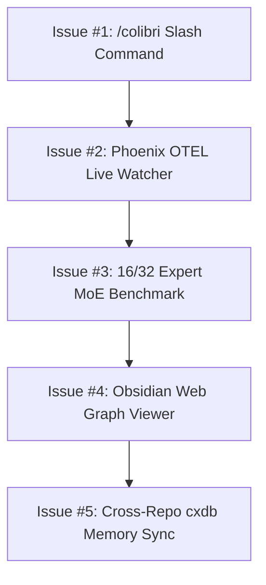

# GitHub Issues & Quality-of-Life Enhancement Roadmap

## Overview

This document outlines all optional Quality-of-Life (QoL) features, user interface shortcuts, telemetry watchers, and MoE scaling tasks formatted as copy-pasteable GitHub Issue specifications.

### System Architecture Flow

## Context

The QoL roadmap extends the `agy-graphify-research` multi-agent orchestration engine with shortcut slash commands, live OpenTelemetry span monitoring, high-concurrency MoE benchmark scaling, and cross-project memory persistence.

---

## GitHub Issue #1: Dedicated `/colibri` Antigravity Slash Command & Skill Integration

### Title
`feat(skills): Add project-scoped /colibri slash command for Colibri MoE operations`

### Description
Implement a dedicated project-scoped skill at `.gemini/skills/colibri/SKILL.md` and `.agents/skills/colibri/SKILL.md` providing shortcut triggers for Colibrì MoE benchmarking, tensor shader inspection, and Direct I/O profiling.

### User Story
As a developer using Google Antigravity, I want to type `/colibri benchmark` or `/colibri inspect` in chat so that the multi-agent harness automatically dispatches the corresponding OpenAI Symphony DAG workflow.

### Tasks
- [ ] Create `.gemini/skills/colibri/SKILL.md` with argument hints (`/colibri benchmark`, `/colibri inspect`, `/colibri optimize`).
- [ ] Register `colibri` task handler in `src/agy_graphify/tasks.py`.
- [ ] Add unit test in `tests/test_tasks.py`.

---

## GitHub Issue #2: Live Phoenix OTEL Telemetry Watcher & Dashboard Sidebar Widget

### Title
`feat(telemetry): Implement live Arize Phoenix OTEL telemetry watcher CLI and event stream widget`

### Description
Create a live telemetry watcher module `src/agy_graphify/telemetry_watcher.py` that polls local Phoenix OTEL span traces (`http://localhost:6006`) and streams real-time execution metrics into `.gemini/telemetry/events.jsonl`.

### Tasks
- [ ] Implement `TelemetryWatcher` class in `src/agy_graphify/telemetry_watcher.py`.
- [ ] Expose `uv run agy-task telemetry-watch` CLI entrypoint in `src/agy_graphify/tasks.py` and `.mise.toml`.
- [ ] Add unit tests for telemetry polling and span correlation.

---

## GitHub Issue #3: Multi-Model Benchmark Expansion (16 & 32 Expert Top-K Routing)

### Title
`feat(benchmark): Expand Colibri MoE benchmark matrix to profile 16 and 32 expert routing configurations`

### Description
Extend `docs/workflows/colibri_moe_benchmark.yaml` and `scratch/colibri/` microbenchmarks to stress-test 16-expert and 32-expert MoE routing under heavy KV cache prefill loads up to the 72GB unified RAM ceiling.

### Tasks
- [ ] Update `docs/workflows/colibri_moe_benchmark.yaml` with expert count parameters.
- [ ] Record unbuffered NVMe Direct I/O throughput for 16 and 32 expert blocks.
- [ ] Update `docs/colibri_benchmark_report.md` with comparative throughput tables.

---

## GitHub Issue #4: Automated Obsidian Vault Visual Web Viewer (`graphify-web`)

### Title
`feat(graphify): Add local web server for rendering interactive Graphify AST graphs and Obsidian wikilinks`

### Description
Implement a lightweight local HTTP server `src/agy_graphify/web_viewer.py` serving interactive D3/Mermaid visual representations of `graphify-out/ast_graph.json` and `docs/wiki/` Obsidian Markdown pages.

### Tasks
- [ ] Create `src/agy_graphify/web_viewer.py` using standard Python `http.server`.
- [ ] Expose `uv run agy-task graphify-web` in `.mise.toml`.
- [ ] Integrate bi-directional `[[wikilink]]` click navigation.

---

## GitHub Issue #5: Multi-Repo Cross-Project Causal Memory Sync (`cxdb` Global Sync)

### Title
`feat(memory): Implement global cross-project cxdb causal DAG memory synchronization`

### Description
Extend `MemoryStoreAdapter` in `src/agy_graphify/telemetry.py` to synchronize `causal_events.jsonl` and `remediation_rules.json` to global user storage (`~/.gemini/antigravity/memory/`), enabling subagents in new workspaces to reuse self-healing rules.

### Tasks
- [ ] Add global sync directory fallback to `MemoryStoreAdapter`.
- [ ] Implement rule deduplication across workspace boundaries.
- [ ] Add unit test verifying global memory persistence.
