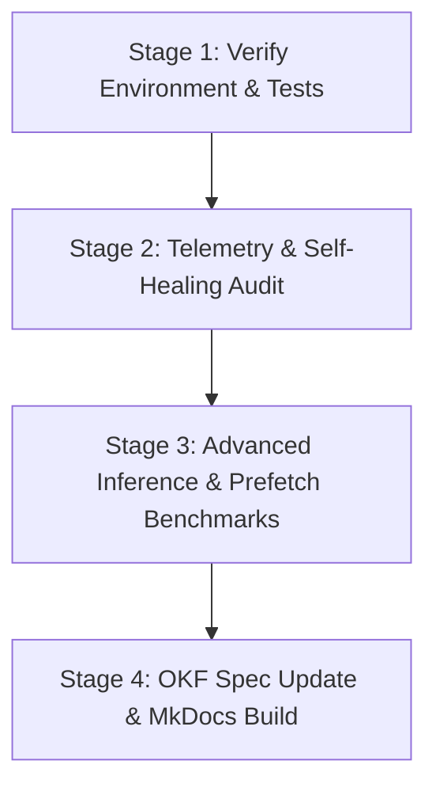

# Autonomous Research & Benchmarking Loop Specification

## Overview

This Open Knowledge Format (OKF) specification defines the iterative research, build, benchmarking, and self-healing telemetry execution loop for evaluating the pure C Metal inference engine `JustVugg/colibri` on Apple Silicon M2 Max (96GB RAM).

All detailed goal parameters, benchmark matrix targets, subagent orchestration rules, and self-healing state are maintained in this document so that agent sessions remain lightweight and context-efficient.

## Hardware & Environment Boundaries

- **Machine Specs**: Apple Silicon M2 Max (12 CPU cores, `FEAT_I8MM` ARM Int8 matrix multiply accelerator, 96GB Unified Memory).
- **RAM Ceiling**: Peak working memory footprint MUST NOT exceed **72 GB safe working limit** (macOS reserves ~24GB for system buffers).
- **Isolated Scratch Directories**:
  - `scratch/colibri/repo/c/`: Colibrì engine build, Metal kernels (`backend_metal.mm`), and `iobench`.
  - `scratch/benchmarks/mise`: Code graph target 1 (19,096 nodes, 45,214 edges).
  - `scratch/benchmarks/compile-time-init-build`: Code graph target 2 (2,161 nodes, 2,871 edges).

## Execution Loop Stages

### Stage 1: Verify Environment & Tests
- Execute `mise run check`
- Execute `PYTHONPATH=src python3 -m pytest` (Verify 13/13 unit tests pass)
- Execute `PYTHONPATH=src python3 -m agy_graphify.okf docs` (Verify OKF compliance)

### Stage 2: Telemetry & Self-Healing Audit
- Inspect telemetry logs in `.gemini/telemetry/` via `TelemetryCollector().analyze_failed_tools()`.
- Emit remediation rules to `.gemini/telemetry/remediation_rules.json`.

### Stage 3: Advanced Inference & Prefetch Benchmarks
- Benchmark direct unbuffered NVMe streaming throughput (`./iobench`) — Baseline: **23.47 GB/s**, **0.8 ms** per 19MB expert block.
- Evaluate sequence length scaling ($S=128, 512, 2048$) and expert prefetching (`PREFETCH=1`, `COLI_MMAP=1`).
- Measure prompt ingestion (tokens/s), generation throughput (tokens/s), and memory footprint.

### Stage 4: OKF Spec Update & MkDocs Build
- Update [docs/colibri_benchmark_report.md](colibri_benchmark_report.md) with updated benchmark matrix.
- Rebuild documentation site via `PYTHONPATH=src:~/.local/lib/python3.14/site-packages python3 -m mkdocs build`.

## Reference Documents

- **OKF Benchmark Report**: [colibri_benchmark_report.md](colibri_benchmark_report.md)
- **Agent Guardrails**: [guardrails.md](guardrails.md)
- **Telemetry & Orchestration Research**: [telemetry_and_orchestration_research.md](telemetry_and_orchestration_research.md)
