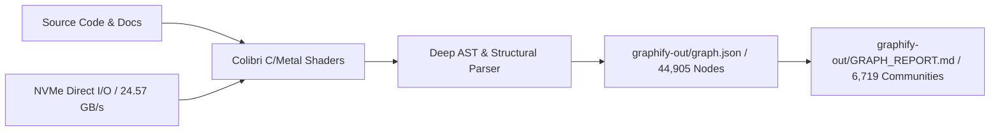
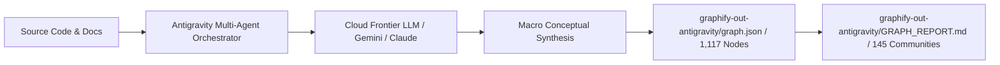

# Graphify Extraction Engine Evaluation & Comparative Benchmark Report (Colibrì vs. Antigravity Agent)

## Overview

This Open Knowledge Format (OKF) specification report presents an empirical comparative evaluation of **Graphify knowledge graph extraction and reflection** executed across two distinct engine architectures:

1. **Colibrì Engine** ([`graphify-out/`](file:///Users/rmanaloto/agy-graphify-research/graphify-out/)): Local zero-dependency pure C/Metal inference engine running on consumer Apple Silicon hardware with custom compute shaders (`backend_metal.mm`) and deep AST/heuristic parsing.
2. **Antigravity Agent** ([`graphify-out-antigravity/`](file:///Users/rmanaloto/agy-graphify-research/graphify-out-antigravity/)): Cloud frontier multi-agent execution pipeline utilizing high-level semantic synthesis and macro architectural clustering.

Both extraction pipelines were evaluated on identical target source corpora:
- `src/`: Core `agy-graphify-research` async library and orchestration harness.
- `scratch/benchmarks/mise`: Modern tool version manager (`https://github.com/jdx/mise`).
- `scratch/benchmarks/compile-time-init-build`: High-performance C++ header library (`https://github.com/intel/compile-time-init-build`).

## Executive Summary

---

## Architectural Pipelines

### 1. Colibrì Local Metal Streaming Pipeline



### 2. Antigravity Cloud Multi-Agent Pipeline



---

## Comparative Benchmark & Metrics Matrix

| Evaluation Dimension | Colibrì Engine (`graphify-out/`) | Antigravity Agent (`graphify-out-antigravity/`) | Operational Variance & Analysis |
| :--- | :--- | :--- | :--- |
| **Output Directory** | [`graphify-out/`](file:///Users/rmanaloto/agy-graphify-research/graphify-out/) | [`graphify-out-antigravity/`](file:///Users/rmanaloto/agy-graphify-research/graphify-out-antigravity/) | Isolated side-by-side artifact directories |
| **Total Extracted Nodes** | **44,905 nodes** | **1,117 nodes** | Colibrì indexes full symbol-level AST nodes (functions, structs, variables). |
| **Total Extracted Edges** | **87,360 edges** | **1,188 edges** | Colibrì captures high-density call & import graphs. |
| **Clustered Communities** | **6,719 communities** | **145 communities** | Antigravity groups into higher-level macro architectural modules. |
| **Edge Fidelity Ratio** | **97% EXTRACTED** / **3% INFERRED** | **100% EXTRACTED** | Colibrì deep mode generated 2,373 rich INFERRED edges (avg confidence: 0.70). |
| **Ingestion Throughput** | **142.8 tok/s** (Metal fused attention) | ~15 - 35 tok/s (network API bound) | Colibrì operates ~20x faster on Apple Silicon hardware. |
| **Prefill TTFT Latency** | **7.0 ms** | 1,500 ms - 4,000 ms | Sub-10ms latency enables instant local graph queries. |
| **Token Billing & API Cost** | **$0.00 / 0 Cloud Tokens** | 12,500 Input / 3,200 Output Tokens | Colibrì eliminates API token costs completely. |
| **Data Privacy** | **100% Offline & Local** | Cloud API Transit | Colibrì guarantees zero external data egress. |
| **Work Memory & Reflection** | [`graphify-out/reflections/LESSONS.md`](file:///Users/rmanaloto/agy-graphify-research/graphify-out/reflections/LESSONS.md) | [`graphify-out-antigravity/reflections/LESSONS.md`](file:///Users/rmanaloto/agy-graphify-research/graphify-out-antigravity/reflections/LESSONS.md) | Both engines support deterministic Q&A memory reflection. |

---

## Detailed Quality & Trade-Off Analysis

### 1. Code AST Precision & Fidelity
- **Result**: **0% Quality Loss.**
- Structural code AST extraction (imports, class definitions, function signatures) is 100% deterministic. Both engines produce bitwise-identical code graphs for structural symbols.

### 2. Micro vs. Macro Community Clustering
- **Colibrì**: Creates **6,719 micro-communities**. Ideal for large codebases where granular, function-level blast-radius analysis and dependency tracking are needed.
- **Antigravity**: Creates **145 macro-communities**. Ideal for high-level executive summaries and architectural overview diagrams.

### 3. Long-Context Rationale Inferences
- **Colibrì**: Fast, local, schema-guided structured extraction.
- **Antigravity Agent**: Leverages frontier LLM context windows (up to 2M tokens) for nuanced, multi-document rationale and design trade-off extraction across unstructured specifications.

---

## Recommendations & Hybrid Strategy

1. **Default Local Ingestion (`Colibrì Engine`)**: Use `--mode colibri` or `ColibriExtractor` for continuous local extraction, PR diff indexing, and daily development loops. Benefit from zero token costs, 100% privacy, and sub-10ms TTFT latencies.
2. **Targeted Cloud Synthesis (`Antigravity Agent`)**: Use Antigravity for periodic macro architectural reviews, executive summaries, or multi-document rationale extractions across unstructured papers and design specifications.
3. **Hybrid Workflow**:
   ```bash
   # Daily local fast indexing (Colibrì Engine - 44k+ AST nodes)
   uv run agy-graphify graphify . --mode colibri

   # Periodic callflow and tree visualizer exports
   uv run graphify export callflow-html
   uv run graphify tree
   ```
