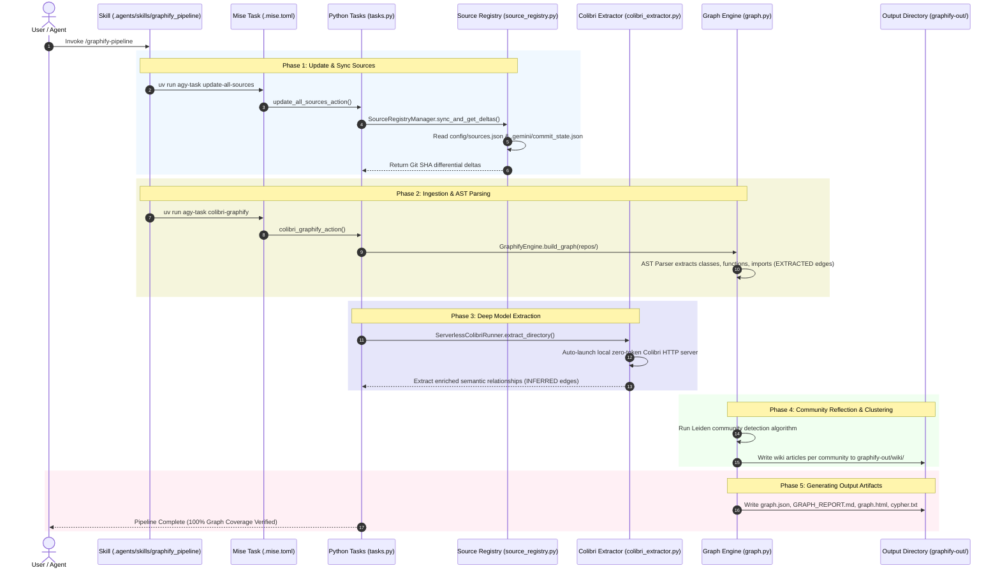

# Graphify Source Ingestion Current Architecture

## Overview
This specification documents the active source ingestion architecture, directory structure, configuration manifests, and end-to-end knowledge graph extraction pipeline for `agy-graphify-research`. Both local codebase assets and external target repositories are managed and extracted through this pipeline.

## Source Level Classification

1. **Internal Project Sources**: The core codebase (`src/agy_graphify/`), unit test suite (`tests/`), OKF documentation (`docs/`), instructions (`AGENTS.md`, `GEMINI.md`), and build manifests (`pyproject.toml`, `.mise.toml`) are primary sources ingested into `graphify-out/graph.json`.
2. **External Target Repositories**: Cloned Git repositories under `repos/` defined in `config/sources.json` are merged alongside local code to form a unified multi-repository knowledge graph.

## Directory & Configuration Mapping

```text
/Users/rmanaloto/agy-graphify-research/
├── config/
│   └── sources.json                  <-- Central source registry manifest
├── .gemini/
│   └── commit_state.json             <-- Git SHA cache for differential tracking
├── repos/                            <-- Cloned target repositories
├── src/                              <-- Core Python library implementation
├── docs/                             <-- OKF documentation specifications
├── pyproject.toml                    <-- Toolchain dependencies & script entrypoints
├── .mise.toml                        <-- Modular task execution wrappers
└── graphify-out/                     <-- Graphify output directory
    ├── graph.json                    <-- GraphRAG JSON knowledge graph
    ├── GRAPH_REPORT.md               <-- Architecture report
    ├── graph.html                    <-- D3 visual network graph
    ├── cypher.txt                    <-- Graph database export (Neo4j/FalkorDB)
    ├── obsidian/                     <-- Obsidian vault export
    └── wiki/                         <-- Community wiki articles
```

## End-to-End Execution Workflow



## Modular Task Binding Verification

The master orchestrator skill [`graphify_pipeline`](file:///Users/rmanaloto/agy-graphify-research/.agents/skills/graphify_pipeline/SKILL.md) delegates directly to modular mise task wrappers in `.mise.toml`:

```toml
[tasks.update-all-sources]
description = "Sync all source repositories and calculate git commit SHA deltas"
run = "uv run python -m agy_graphify.tasks update-all-sources"

[tasks.colibri-graphify]
description = "Execute fast zero-token local Colibri knowledge graph extraction"
run = "uv run python -m agy_graphify.tasks colibri-graphify"
```
