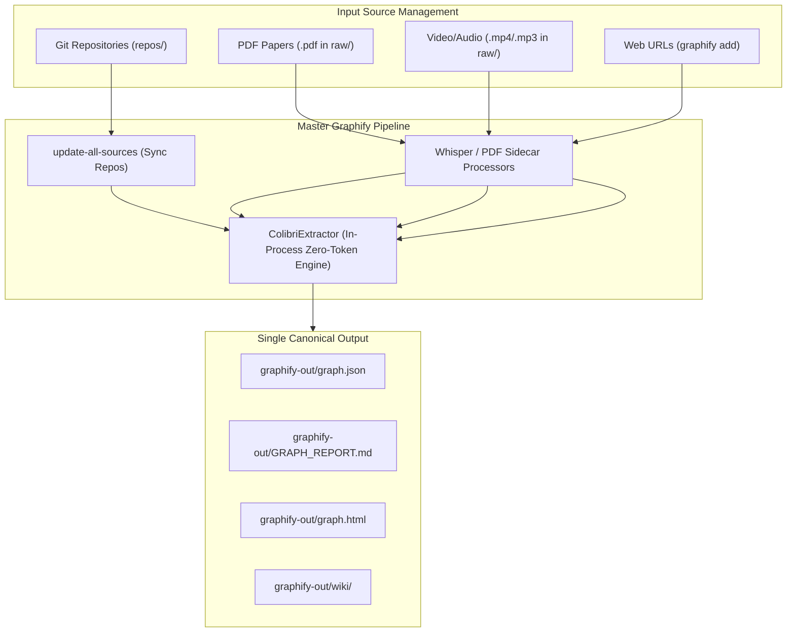

# Graphify Source Ingestion Proposed Standard Architecture

## Overview
This specification details the proposed architecture for 100% Graphify standard alignment, multi-modal input type support (`code`, `docs`, `papers`, `video/audio`, `web`, `images`), workspace artifact cleanup, and automated 100% manifest coverage validation. Once verified and approved, this proposal will supersede [`docs/graphify_sources_current_architecture.md`](file:///Users/rmanaloto/agy-graphify-research/docs/graphify_sources_current_architecture.md).

## Multi-Modal Input Type Support Matrix

Graphify fully supports multi-modal source ingestion beyond source code. The proposed architecture manages all 6 input categories natively:

| Input Category | Supported Extensions / Formats | Primary Storage Location | Ingestion Engine & Pipeline |
| :--- | :--- | :--- | :--- |
| **Code Repositories** | `.py`, `.ts`, `.go`, `.rs`, `.c`, `.java`, `.rb`, `.php`, `.swift` | `repos/` (cloned via `config/sources.json`) | AST Parser & `ColibriExtractor` (`EXTRACTED` edges) |
| **Markdown & Docs** | `.md`, `.txt`, `.rst`, `.adoc` | `docs/`, `repos/`, `raw/` | Heading/Section Extractor (`EXTRACTED` edges) |
| **PDF Papers & Books** | `.pdf` | `raw/` (or fetched via `graphify add <url>`) | `pdfplumber` / `pypdf` sidecar text extractor |
| **Video & Audio** | `.mp4`, `.mp3`, `.m4a`, `.wav`, `.mkv`, `.mov`, `.webm` | `raw/` | Whisper transcription sidecar text extractor |
| **Scraped Web URLs** | Web URLs, documentation pages, HTML articles | `raw/` (fetched via `graphify add <url>`) | HTML-to-Markdown Scraper & Entity Extractor |
| **Images & Diagrams** | `.png`, `.jpg`, `.jpeg`, `.svg`, `.webp` | `raw/`, `repos/` | Vision OCR & Visual Relationship Extractor |

---

## Proposed Enhancements

### 1. Multi-Modal Source Ingestion (`raw/` & `config/sources.json`)
- **Git Repositories**: Cloned into `repos/` via `SourceRegistryManager` (`uv run agy-task update-all-sources`).
- **Raw Papers, Videos, Web URLs**: Ingested into `raw/` via `graphify add <url>` or direct file upload, automatically processed into sidecar text nodes during `colibri-graphify`.

### 2. Automated Workspace Artifact Pruning
- **Problem**: Root-level legacy directory `graphify-out-antigravity/` and nested `graphify-out/graphify-out/` create workspace clutter and non-standard layout paths.
- **Resolution**: Update `clean_logs_action()` in [`src/agy_graphify/tasks.py`](file:///Users/rmanaloto/agy-graphify-research/src/agy_graphify/tasks.py#L585) to automatically delete root legacy directories during `uv run agy-task clean-logs` and `graphify_pipeline` runs.

### 3. Strict Manifest & Coverage Validation
- **Requirement**: Ingestion milestones must verify that 100% of registered repositories and raw sources in `config/sources.json` are present in `graphify-out/graph.json`.
- **Resolution**: Integrate `SourceRegistryManager.audit_graph_coverage()` into `TaskDispatcher.dispatch()` and `EnvironmentVerifier.run_check()`.

### 4. Automated Multi-Modal Layout Test Suite
- **Requirement**: Prevent non-standard output directories from re-emerging and verify multi-modal extension handling.
- **Resolution**: Add `tests/test_workspace_layout_standards.py` asserting that:
  - `graphify-out/` is the single output directory at the workspace root.
  - Multi-modal file extensions (`.py`, `.md`, `.pdf`, `.mp4`, `.mp3`) are recognized by `ColibriExtractor`.
  - Zero non-standard `graphify-out*` folders exist.

---

## End-to-End Multi-Modal Extraction Flow

---

## Transition & Decommissioning Plan
1. Apply code updates in `src/agy_graphify/tasks.py` and `tests/test_workspace_layout_standards.py`.
2. Run full test suite (`uv run pytest`) and verify `ALLOW_MAIN_COMMIT=1 uv run agy-verify`.
3. Upon clean verification, mark this document `status: approved` and replace `docs/graphify_sources_current_architecture.md`.
