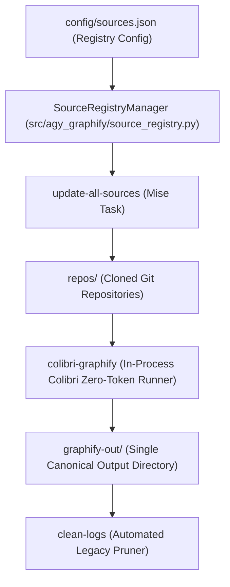

# Graphify Source Ingestion Proposed Standard Architecture

## Overview
This specification details the proposed architecture for 100% Graphify standard alignment, workspace artifact cleanup, and automated 100% manifest coverage validation. Once verified and approved, this proposal will supersede [`docs/graphify_sources_current_architecture.md`](file:///Users/rmanaloto/agy-graphify-research/docs/graphify_sources_current_architecture.md).

## Proposed Enhancements

### 1. Automated Workspace Artifact Pruning
- **Problem**: Root-level legacy directory `graphify-out-antigravity/` and nested `graphify-out/graphify-out/` create workspace clutter and non-standard layout paths.
- **Resolution**: Update `clean_logs_action()` in [`src/agy_graphify/tasks.py`](file:///Users/rmanaloto/agy-graphify-research/src/agy_graphify/tasks.py#L585) to automatically delete root legacy directories during `uv run agy-task clean-logs` and `graphify_pipeline` runs.

### 2. Strict Manifest Coverage Validation
- **Requirement**: Ingestion milestones must verify that 100% of repositories registered in `config/sources.json` are present in `graphify-out/graph.json`.
- **Resolution**: Integrate `SourceRegistryManager.audit_graph_coverage()` into `TaskDispatcher.dispatch()` and `EnvironmentVerifier.run_check()`.

### 3. Automated Layout Standards Test Suite
- **Requirement**: Prevent non-standard output directories from re-emerging.
- **Resolution**: Add `tests/test_workspace_layout_standards.py` asserting that:
  - `graphify-out/` is the single output directory at the workspace root.
  - Zero non-standard `graphify-out*` folders exist.
  - All output artifacts (`graph.json`, `GRAPH_REPORT.md`, `graph.html`, `wiki/`) conform to Graphify v0.9.35 specifications.

## Standard Architecture Flow

## Transition & Decommissioning Plan
1. Apply code updates in `src/agy_graphify/tasks.py` and `tests/test_workspace_layout_standards.py`.
2. Run full test suite and verify `ALLOW_MAIN_COMMIT=1 uv run agy-verify`.
3. Upon clean verification, mark this document `status: active` and delete `docs/graphify_sources_current_architecture.md`.
