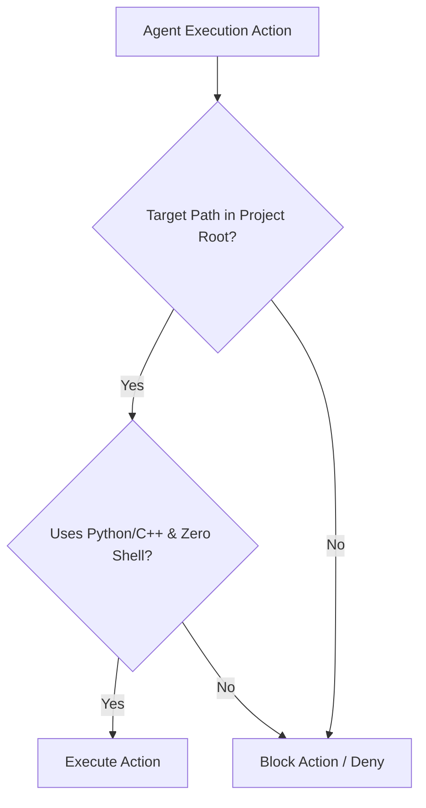

# Agent Guardrails & Isolation Specification

## Overview

Defines the security and execution boundaries enforced on autonomous agents to guarantee zero global state mutation and strict project-level isolation.

## Core Concepts

- **Zero Global Mutations**: Agents MUST NOT modify `~/.gemini/` or system configurations outside `/Users/rmanaloto/agy-graphify-research/`.
- **Audit 3rd-Party Tools First**: Agents MUST search for existing, active free/open-source modern 3rd-party tools/libraries before writing custom code.
- **Python & C++ Exclusively**: Shell scripts and raw bash are prohibited in source control.

## Security & Isolation Guardrails

## Relationships & References

- **Pre-commit & Post-commit Hooks**: Enforced via `hk` and `.gemini/hooks/verify_environment.py`.
