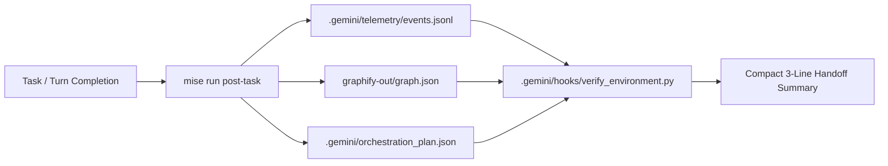

# Session Handoff & Progressive State Specification

## Overview

Defines how project state, knowledge graph data, telemetry logs, and pending tasks are packaged by hooks to provide seamless session handoffs to new agent turns.

## Core Concepts

- **Handoff Payload**: Session hook `.gemini/hooks/verify_environment.py` inspects `.gemini/telemetry/events.jsonl`, `graphify-out/graph.json`, and `.gemini/orchestration_plan.json`.
- **Progressive Disclosure**: Hook emits a compact 3-line summary in `additionalContext` with pointers to target documents, preventing context bloat.
- **State Persistence**: `mise run post-task` automatically refreshes handoff state after every major task or PR.

## Session Handoff Flowchart

## Relationships & References

- Registered in `.gemini/trusted_hooks.json`.
- Parsed by `TelemetryCollector` in `src/agy_graphify/telemetry.py`.
