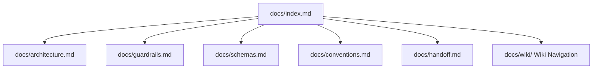

# AGY Graphify Research Documentation Hub

## Overview

Welcome to the AGY Graphify Research documentation hub. This repository contains the Python library, project plugin, state/toolchain verification tools, telemetry framework, and multi-agent orchestration engine for Antigravity & Graphify.

## Core Documentation Modules

- **[Agent Guardrails & Isolation](guardrails.md)**: Security boundaries and execution rules.
- **[JSON Schemas Specification](schemas.md)**: Pydantic V2 models and JSON schema definitions.
- **[Telemetry & Multi-Agent Orchestration Research](telemetry_and_orchestration_research.md)**: Comprehensive evaluation of Arize Phoenix, LangGraph, and OKF compliance.
- **[Colibrì Pure C Engine Benchmark Report](colibri_benchmark_report.md)**: High-performance Apple Silicon benchmark report.

## Documentation Structure Map



## Verification & Execution Commands

```bash
# Run full check suite (models, ruff, ty, pytest, OKF validation)
mise run check

# Build local documentation site
PYTHONPATH=src:~/.local/lib/python3.14/site-packages python3 -m mkdocs build
```
