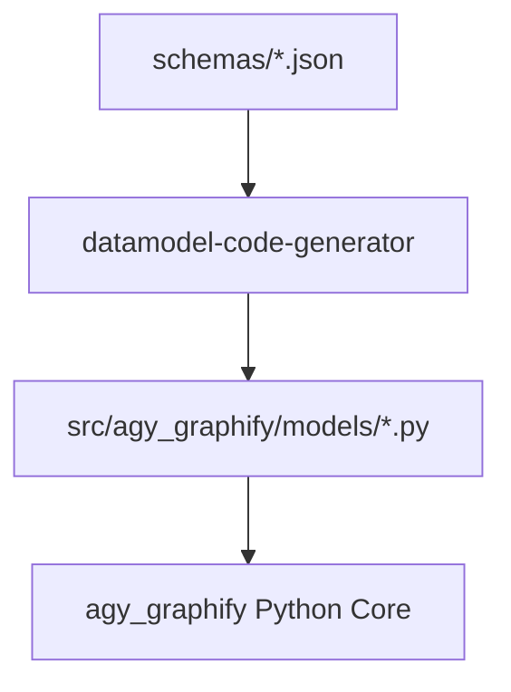

# JSON Schemas Specification

## Overview

Contains JSON Schema definitions in `schemas/` that serve as the single source of truth for autogenerated Pydantic V2 models:
- `schemas/graph_schema.json`: Knowledge graph nodes, edges, metadata.
- `schemas/orchestration_schema.json`: Multi-agent execution plans.
- `schemas/verification_schema.json`: Environment verification decisions.

## Core Concepts

All Pydantic models in `src/agy_graphify/models/` are autogenerated via `datamodel-code-generator` from these JSON schemas.

## Schema Codegen Flowchart

