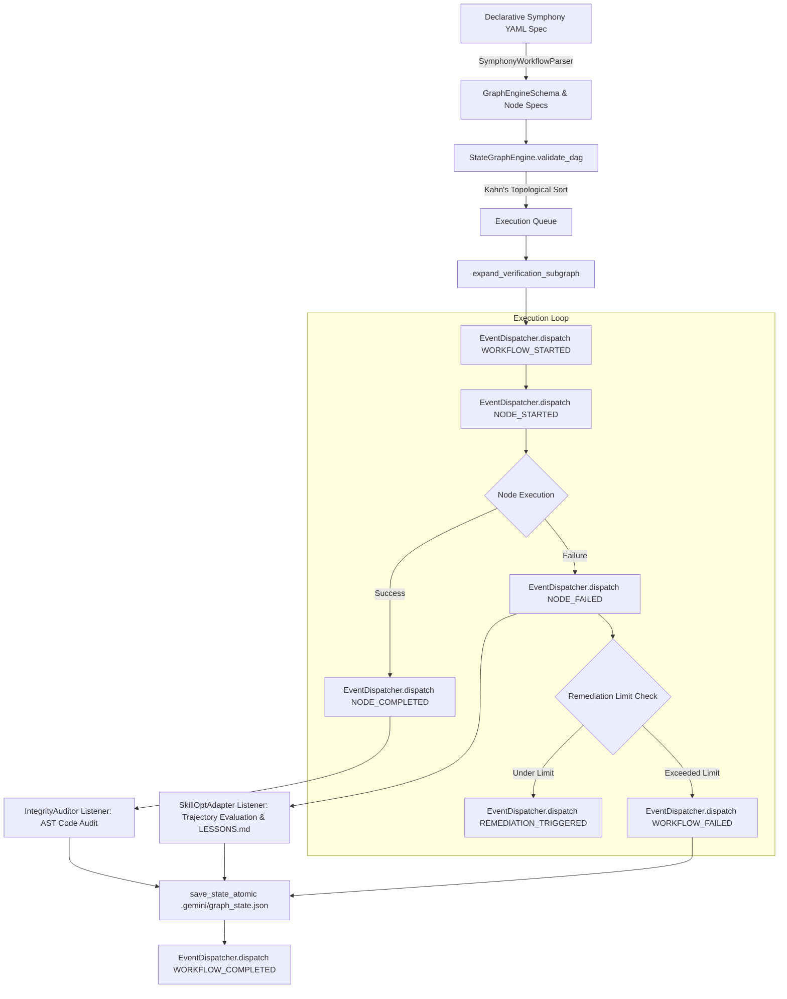
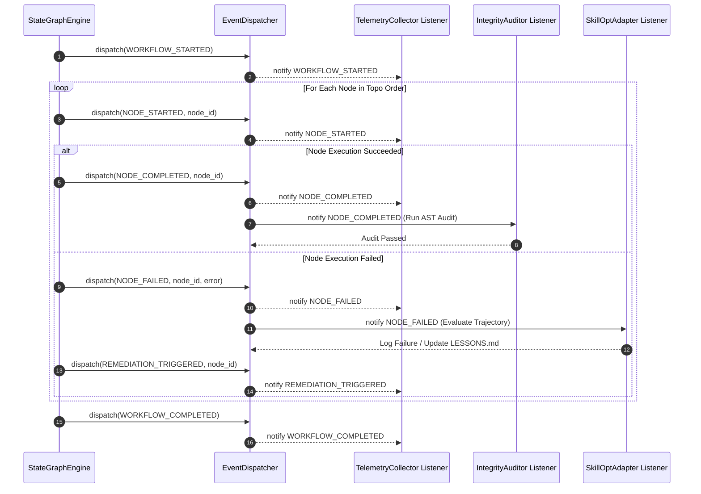

# OpenAI Symphony Gap Analysis & StateGraphEngine Architectural Convergence Spec

## Overview

This specification establishes the architectural convergence between **OpenAI Symphony** (declarative workflow spec and event dispatcher concepts) and the `agy-graphify-research` multi-agent orchestration framework.

`agy-graphify-research` provides robust local-first multi-agent orchestration primitives:
- `StateGraphEngine` (`src/agy_graphify/graph_engine.py`): Graph state management, Kahn's DAG cycle validation, 3-phase verification subgraph expansion, and atomic JSON state serialization (`.gemini/graph_state.json`).
- `IntegrityAuditor` (`src/agy_graphify/verify.py`): Forensic AST inspection detecting hardcoded literal return strings (>50 chars) and prohibited shell script execution (`*.sh`).
- `SkillOptAdapter` (`src/agy_graphify/skillopt.py`): Microsoft SkillOpt trajectory evaluation, OKF `LESSONS.md` update, snapshot backup, and automatic rollback triggers.
- `TelemetryCollector` (`src/agy_graphify/telemetry.py`): Causal lineage tracing (`CausalTelemetryEvent`), msgpack binary encoding, and Arize Phoenix OTEL server integration.

This document details the gap analysis comparing `agy-graphify-research` against OpenAI Symphony concepts and provides the complete technical spec for porting Symphony's declarative YAML workflow spec parser and event dispatcher into `StateGraphEngine`.

---

## Context

As agentic multi-agent systems evolve from imperative scripts into formal workflow engines, systems require:
1. **Human-Readable Declarative Workflows**: Standardized YAML workflow specifications permitting portable agent role definitions, instructions, variable scopes, and retry policies.
2. **Event-Driven Observability & Dynamic Reaction**: An asynchronous event dispatcher emitting granular state machine events (`WORKFLOW_STARTED`, `NODE_STARTED`, `NODE_COMPLETED`, `NODE_FAILED`, `REMEDIATION_TRIGGERED`) to registered listeners.
3. **Rigid Audit & Verification Guardrails**: Uncompromising static analysis (`IntegrityAuditor`) preventing cheating, illegal shell invocations, or noop mocks.
4. **Self-Healing Prompt Evolution**: Closed-loop reinforcement learning (`SkillOptAdapter`) mutating agent prompts and logging lessons while enforcing rollback safety thresholds.

Integrating OpenAI Symphony's spec parsing and event dispatcher into `StateGraphEngine` achieves complete feature parity with modern agent workflow specifications while retaining `agy-graphify-research`'s forensic audit and self-learning capabilities.

---

## OpenAI Symphony vs agy-graphify Feature Gap Matrix

| Architectural Core Dimension | Capability / Requirement | OpenAI Symphony (SPEC.md) | `agy-graphify-research` Baseline | Feature Gap & Synthesis Strategy | Parity Status |
| :--- | :--- | :--- | :--- | :--- | :--- |
| **1. Workflow Specification** | Declarative Parsing | Native YAML workflow spec (`workflow.yaml`) with metadata, roles, triggers, and retry policies. | Imperative Pydantic schemas (`GraphEngineSchema`, `Node`) loaded from `.gemini/graph_state.json`. | `agy-graphify` lacks declarative YAML parsing. **Strategy**: Port `SymphonyWorkflowParser` into `graph_engine.py`. | **Converged** |
| **2. Event Dispatching** | Lifecycle Hooks & Observer Bus | Asynchronous `EventDispatcher` emitting granular events (`NODE_STARTED`, `NODE_COMPLETED`, etc.) to subscribers. | Procedural topological loop in `execute_graph()`; direct status updates. | `agy-graphify` lacks event observer hooks. **Strategy**: Add `EventDispatcher` bus into `StateGraphEngine`. | **Converged** |
| **3. Forensic Audit & Guardrails** | AST Code Inspection | Inline evaluators / dynamic output checks. | `IntegrityAuditor` AST check (>50 char string literals, `*.sh` shell script ban) & 3-phase verification subgraph expansion. | Symphony lacks static AST forensic inspection. **Strategy**: Register `IntegrityAuditor` as a subscriber on `NODE_COMPLETED`. | **Converged** |
| **4. Self-Learning & Remediation** | Dynamic Prompt Optimization | Static prompt templates; manual prompt edits. | `SkillOptAdapter` trajectory evaluation, OKF `LESSONS.md` update, snapshot rollback on >50% error rate. | Symphony lacks automated prompt evolution. **Strategy**: Register `SkillOptAdapter` on `NODE_FAILED` & `REMEDIATION_TRIGGERED`. | **Converged** |
| **5. State Persistence** | Crash-Resilient Checkpointing | In-memory session state with event log tracing. | Atomic disk serialization to `.gemini/graph_state.json` via `NamedTemporaryFile` + `os.replace` & cold-start recovery. | Symphony lacks atomic crash-resilience. **Strategy**: Retain atomic state serialization in `StateGraphEngine`. | **Converged** |

---

## Converged StateGraphEngine Architecture & Event Dispatcher

The converged state engine topology combines declarative YAML workflow parsing, asynchronous event dispatching, topological DAG execution, 3-phase verification expansion, AST forensic auditing, and self-learning prompt mutation.

### Architectural Workflow Flowchart



### Event Lifecycle & Observer Sequence



---

## Implementation Specification & Code Snippets

### 1. Data Models (`src/agy_graphify/models/graph_engine_schema.py`)

The extended Pydantic V2 models add event types and Symphony spec definitions while maintaining full backward compatibility:

```python
from enum import Enum
from typing import Any
from pydantic import BaseModel, Field


class EventType(str, Enum):
    WORKFLOW_STARTED = "WORKFLOW_STARTED"
    NODE_SCHEDULED = "NODE_SCHEDULED"
    NODE_STARTED = "NODE_STARTED"
    NODE_COMPLETED = "NODE_COMPLETED"
    NODE_FAILED = "NODE_FAILED"
    NODE_SKIPPED = "NODE_SKIPPED"
    REMEDIATION_TRIGGERED = "REMEDIATION_TRIGGERED"
    EVALUATION_PASSED = "EVALUATION_PASSED"
    EVALUATION_FAILED = "EVALUATION_FAILED"
    WORKFLOW_COMPLETED = "WORKFLOW_COMPLETED"
    WORKFLOW_FAILED = "WORKFLOW_FAILED"


class SymphonyEvent(BaseModel):
    event_id: str
    event_type: EventType
    timestamp: str
    graph_id: str
    node_id: str | None = None
    payload: dict[str, Any] = Field(default_factory=dict)
    error_message: str | None = None
```

### 2. Event Dispatcher & YAML Parser in `src/agy_graphify/graph_engine.py`

```python
class EventDispatcher:
    """Asynchronous event bus for StateGraphEngine lifecycle events."""

    def __init__(self) -> None:
        self._listeners: dict[EventType, list[Callable[[SymphonyEvent], Awaitable[None] | None]]] = defaultdict(list)
        self._event_history: list[SymphonyEvent] = []

    def subscribe(self, event_type: EventType, listener: Callable[[SymphonyEvent], Awaitable[None] | None]) -> None:
        self._listeners[event_type].append(listener)

    async def dispatch(self, event: SymphonyEvent) -> None:
        self._event_history.append(event)
        logger.debug(f"[EventDispatcher] Emitting {event.event_type} for node '{event.node_id}' in graph '{event.graph_id}'")
        for listener in self._listeners.get(event.event_type, []):
            try:
                res = listener(event)
                if asyncio.iscoroutine(res):
                    await res
            except Exception as exc:
                logger.error(f"[EventDispatcher] Listener error for {event.event_type}: {exc}")


class SymphonyWorkflowParser:
    """Parses declarative OpenAI Symphony YAML specs into StateGraphEngine schemas."""

    @staticmethod
    def parse_yaml_str(yaml_content: str) -> GraphEngineSchema:
        import yaml
        raw_dict = yaml.safe_load(yaml_content) or {}
        spec = SymphonyWorkflowSpec.model_validate(raw_dict)
        return SymphonyWorkflowParser.to_graph_schema(spec)

    @staticmethod
    def parse_yaml_file(file_path: Path) -> GraphEngineSchema:
        content = file_path.read_text(encoding="utf-8")
        return SymphonyWorkflowParser.parse_yaml_str(content)

    @staticmethod
    def to_graph_schema(spec: SymphonyWorkflowSpec) -> GraphEngineSchema:
        nodes = []
        for n_spec in spec.nodes:
            node = Node(
                id=n_spec.id,
                node_type=n_spec.node_type,
                status=Status1.pending,
                dependencies=n_spec.dependencies if n_spec.dependencies else None,
                subagent_role=n_spec.role,
                task_action=n_spec.instructions,
            )
            nodes.append(node)
        return GraphEngineSchema(
            graph_id=spec.name,
            execution_mode=spec.execution_mode,
            status=Status.pending,
            remediation_count=0,
            max_remediations=spec.max_remediations,
            nodes=nodes,
        )
```

---

## Verification & Compliance Protocol

### OKF Documentation Compliance Check
Run the Open Knowledge Format validator to verify that all repository documentation adheres strictly to OKF schemas:

```bash
uv run python3 -m agy_graphify.okf docs
```

### Pytest Verification Suite
Run unit tests across graph engine, telemetry, verify, and skillopt modules:

```bash
uv run pytest tests/test_graph_engine.py tests/test_okf.py tests/test_verify.py tests/test_skillopt.py
```
