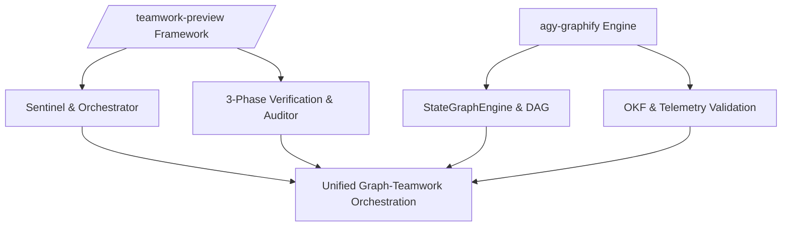

## Overview

This report provides an exhaustive technical gap analysis comparing the `/teamwork-preview` framework (Sentinel, Project Orchestrator, Victory Auditor, 3-phase verification, Integrity modes) against the `agy-graphify-research` multi-agent orchestration framework (OrchestrationEngine, StateGraphEngine, SkillOptAdapter, OKF validator).

Both frameworks provide advanced multi-agent coordination capabilities for AI-assisted software engineering, research, and verification, but embody different design philosophies:
- `/teamwork-preview` prioritizes strict hierarchical delegation, human-like team dynamics, rigid multi-tier verification loops, and zero-tolerance forensic cheating detection.
- `agy-graphify-research` prioritizes programmatic DAG graph execution engines, automated prompt optimization via Microsoft SkillOpt, OpenTelemetry tracing with Arize Phoenix, and strict toolchain guardrails (such as the zero shell script policy).

This document establishes a 5-dimension feature matrix comparing both architectures and details an actionable 3-phase roadmap for framework convergence.

### Framework Convergence Architecture

## Context

Multi-agent orchestration frameworks operate under stringent operational constraints, including LLM context truncation limits (monitored at 40%–50% capacity thresholds), restricted execution sandbox modes (`CODE_ONLY`), and strict audit requirements.

In `agy-graphify-research`, agent execution is governed by `AGENTS.md` and configured via `plugin.json` manifests. Tasks are structured into acyclic directed graphs (DAGs) resolved by `StateGraphEngine`.

In `/teamwork-preview`, agent execution is governed by immutable `BRIEFING.md` indexes and structured around Sentinel-to-Orchestrator delegation. Implementation tracks run a strict Explorer -> Worker -> Reviewer -> Challenger -> Auditor verification loop.

Evaluating these architectures across five core dimensions illuminates structural gaps and points of synthesis:
1. Agent Subsystem Archetypes & Roles
2. Workflow & Graph Execution
3. Audit & Verification Mechanisms
4. Self-Learning & Telemetry
5. State Persistence & Checkpointing

## Feature Matrix

| Core Architectural Dimension | Capability / Requirement | `/teamwork-preview` Implementation | `agy-graphify-research` Implementation | Feature Gap Assessment | Parity Status |
| :--- | :--- | :--- | :--- | :--- | :--- |
| **1. Agent Subsystems & Roles** | Role Archetype Definitions | 8 isolated roles (Sentinel, Orchestrator, Victory Auditor, Explorer, Worker, Reviewer, Challenger, Sub-Orchestrator). | 7 specialized roles (Coordinator/Planner, Code Base Researcher, Schema Builder, Verifier, QA, OKF Specialist, Learning Agent). | `/teamwork` enforces strict directory-isolated worker instances; `agy-graphify` relies on role tags in `AGENTS.md`. | High Parity |
| **1. Agent Subsystems & Roles** | Context Window Management | Self-succession protocol triggered when spawn count >= 16 or context degrades. | `ContextManagerEngine` monitoring 40%-50% token thresholds (80k-100k tokens). | `/teamwork` uses spawn-based succession; `agy-graphify` uses token-level monitoring. | Complementary |
| **2. Workflow & Graph Execution** | Execution Graph Model | Multi-level tree delegation (Sentinel -> Project Orchestrator -> Sub-Orchestrator). | `StateGraphEngine` executing Python DAG nodes (`Node`, `GraphState`) with Kahn's topological sort. | `/teamwork` models organizational hierarchy; `agy-graphify` models programmatic DAG state transitions. | Complementary |
| **2. Workflow & Graph Execution** | Verification Cycle Topology | 3-Phase verification cycle (Explorer -> Worker -> Reviewer -> Challenger -> Auditor -> Gate). | Bounded remediation loops (max 3 retries) within DAG execution engine. | `/teamwork` has explicit multi-role verification; `agy-graphify` relies on programmatic node conditions. | `/teamwork` Leads |
| **3. Audit & Verification** | Forensic Integrity Audit | Mandatory Victory Audit by `teamwork_preview_auditor` with zero-tolerance binary veto. | Static checks via `EnvironmentVerifier` (`verify.py`) and OKF validator (`okf.py`). | `/teamwork` prevents hardcoding and cheating via forensic AST/execution tracing; `agy-graphify` lacks forensic auditor. | `/teamwork` Leads |
| **3. Audit & Verification** | Toolchain & Script Guardrails | Execution logging and verification method documentation in handoff.md. | Strict Zero Shell Script Policy (`*.sh` ban) enforced by `hk.pkl` and `EnvironmentVerifier`. | `agy-graphify` has automated static linter enforcement against shell script drift. | `agy-graphify` Leads |
| **4. Self-Learning & Telemetry** | Automated Prompt Mutation | Manual briefing handoffs and retrospective notes in progress.md. | `SkillOptAdapter` implementing Microsoft SkillOpt prompt mutation & reinforcement scoring. | `agy-graphify` automates prompt evolution; `/teamwork` relies on human-driven prompt adjustments. | `agy-graphify` Leads |
| **4. Self-Learning & Telemetry** | Execution Telemetry & Liveness | Heartbeat crons (`schedule`) every 10 min + `progress.md` liveness timestamps. | Arize Phoenix OpenTelemetry tracing logging to `.gemini/telemetry/`. | `/teamwork` monitors active agent liveness; `agy-graphify` captures fine-grained OTEL spans. | Complementary |
| **5. State Persistence** | State Checkpointing Format | Human-readable Markdown state (`BRIEFING.md`, `progress.md`, `plan.md`, `SCOPE.md`, `handoff.md`). | Machine-readable `GraphState` JSON serialization via atomic writes (`atomic_write_json`). | `/teamwork` optimizes context recovery for LLMs; `agy-graphify` optimizes state resumption for graph engines. | High Parity |
| **5. State Persistence** | Succession & State Transfer | Soft handoff protocol dumping state to `handoff.md` before spawning successor. | Cold-start state rehydration from `.gemini/orchestration_plan.json` and `.gemini/graph_state.json`. | Both frameworks provide reliable recovery mechanisms after context reset. | Full Parity |

## Missing Features Roadmap

### 1. Features in `/teamwork-preview` Missing in `agy-graphify-research`

1. **Mandatory Forensic Victory Auditor & Cheating Detection**:
   - *Gap*: `agy-graphify-research` currently relies on unit tests (`pytest`) and schema validation (`okf.py`), but lacks adversarial integrity detection to catch hardcoded test outputs or facade implementations.
   - *Remediation Plan*: Port `teamwork_preview_auditor` logic into `src/agy_graphify/verify.py` as an `IntegrityAuditor` class. Add AST inspection to detect static string returns in test targets.

2. **3-Phase Explorer -> Worker -> Reviewer -> Challenger -> Auditor Verification Loop**:
   - *Gap*: `StateGraphEngine` executes linear DAG node transitions without multi-agent adversarial challenge rounds.
   - *Remediation Plan*: Extend `StateGraphEngine` with a `VerificationSubgraph` pattern that automatically inserts Reviewer, Challenger, and Auditor nodes before completing any code modification node.

3. **Sentinel Liveness Heartbeats & Succession Protocol**:
   - *Gap*: `agy-graphify-research` relies on token threshold checks but lacks heartbeat cron monitoring for stuck subagents.
   - *Remediation Plan*: Implement background liveness crons in `OrchestrationEngine` that monitor `progress.md` timestamps and trigger agent replacement if unresponsive for >10 minutes.

### 2. Features in `agy-graphify-research` Missing in `/teamwork-preview`

1. **Programmatic SkillOpt Prompt Mutation & Optimization**:
   - *Gap*: `/teamwork-preview` uses static role prompts and manual briefing updates without automated RL/scoring-based prompt evolution.
   - *Remediation Plan*: Integrate `SkillOptAdapter` into `/teamwork-preview` orchestrator dispatch, enabling prompts to automatically evolve based on subagent success rates recorded in `progress.md`.

2. **Arize Phoenix OpenTelemetry (OTEL) Tracing**:
   - *Gap*: `/teamwork-preview` relies on markdown logs, making execution visualization and span tracing difficult across deep agent hierarchies.
   - *Remediation Plan*: Emit standard OTEL spans during `invoke_subagent` calls, writing trace data to `.gemini/telemetry/` for visualization in Phoenix.

3. **Automated Linter Guardrails (Zero Shell Script Policy)**:
   - *Gap*: `/teamwork-preview` does not natively enforce toolchain pinning or `*.sh` script bans at git pre-commit boundaries.
   - *Remediation Plan*: Adopt `hk.pkl` linting rules within `/teamwork-preview` workspace verification pipelines.

### 3. Unified Architectural Convergence Plan

- **Phase 1: Integrity & Security Hardening (Q3 2026)**
  - Integrate Forensic Victory Auditor into `agy-graphify-research` verification pipeline (`uv run agy-verify`).
  - Add strict zero-tolerance binary veto rules to `OrchestrationEngine`.
- **Phase 2: Adaptive Execution & Observability (Q4 2026)**
  - Wire `SkillOptAdapter` prompt mutation into `/teamwork-preview` subagent dispatch loops.
  - Implement unified OpenTelemetry span generation across all agent workspace handoffs.
- **Phase 3: Hybrid Orchestration Engine (Q1 2027)**
  - Merge `StateGraphEngine` DAG execution with Sentinel/Orchestrator tree delegation into a unified hybrid multi-agent orchestration runtime.
  - Support dual state persistence: machine-readable JSON graph state + human-readable OKF Markdown handoffs.
