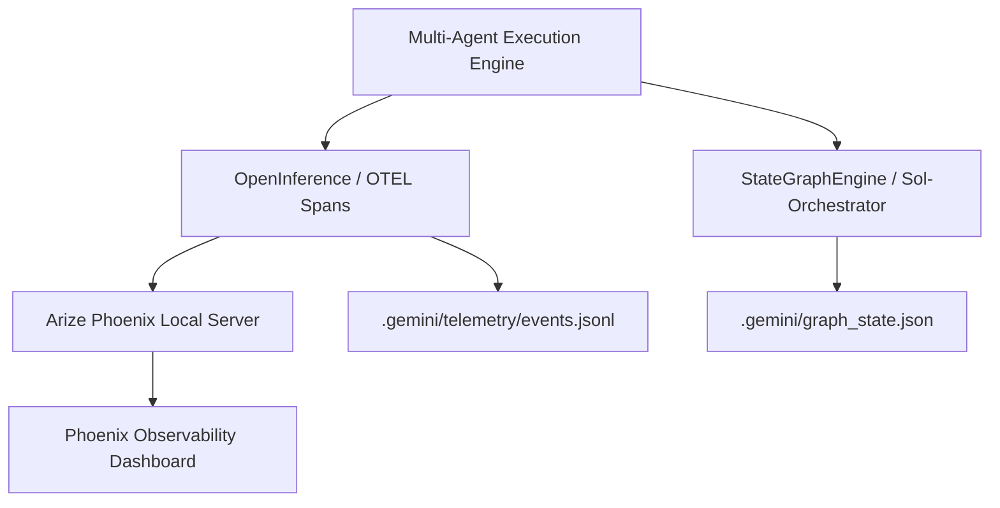

# Telemetry and Multi-Agent Graph Framework Research

## Overview

As autonomous AI agent architectures evolve from simple linear chains into complex multi-agent graphs, system reliability, deterministic execution, and operational visibility become paramount. The `agy-graphify-research` project requires a robust infrastructure for two core pillars:

1. **Telemetry & Observability**: Tracking prompt/completion spans, tool invocations, execution latencies, subagent handoffs, and failure tracebacks without violating local isolation or introducing mandatory cloud dependencies.
2. **Multi-Agent Graph Engineering**: Orchestrating heterogeneous subagent roles (e.g., Coordinator, Researcher, Developer, Verifier, QA Reviewer, OKF Specialist, Learning Agent) through stateful, cyclical, and parallel execution graphs.

This document presents a comprehensive evaluation of state-of-the-art telemetry platforms and multi-agent graph orchestration frameworks. It provides comparative pros/cons analyses and articulates the strategic architectural recommendations for `agy-graphify-research`.

### Telemetry & Graph Architecture Flowchart

---

## Telemetry & Observability Candidates

Effective telemetry in agentic systems demands granular span instrumentation across LLM calls, tool executions, memory lookups, and graph state transitions. Below is an in-depth evaluation of six key candidates.

### 1. Arize Phoenix (OpenInference & OpenTelemetry Native)

* **Architecture**: Open-source, local-first telemetry server built on the OpenInference semantic conventions and OpenTelemetry (OTEL) standard.
* **Key Features**:
  * Local visualization server launched in-process or via lightweight sidecar (`phoenix.launch_app()`).
  * Automatic tracing instrumentation for major LLM providers and agent frameworks.
  * Direct export capabilities to local file stores (JSONL, MsgPack) and remote OTEL collectors.
* **Strengths**: Zero cloud dependency required; fully aligned with open OTEL standards; lightweight integration into Python packages.
* **Limitations**: Full browser UI introduces additional package dependencies; requires file fallback if local web ports are restricted.

### 2. OpenTelemetry (OTLP Standard API & SDK)

* **Architecture**: The CNCF vendor-neutral observability framework for distributed tracing, metrics, and logging.
* **Key Features**:
  * Standardized `opentelemetry-api` and `opentelemetry-sdk` primitives.
  * Extensible SpanProcessors and OTLP exporters (gRPC/HTTP).
  * Strict schema specification for distributed tracing.
* **Strengths**: Absolutely zero vendor lock-in; universal compatibility across APM backends; enterprise-grade stability.
* **Limitations**: Highly generic API requiring custom wrappers or semantic conventions (OpenInference) for LLM-specific telemetry.

### 3. LangSmith

* **Architecture**: Closed-core cloud and enterprise platform developed by LangChain for LLM tracing and evaluation.
* **Key Features**:
  * Rich visual tracing tree for multi-step agent chains.
  * Integrated prompt playbooks, dataset curation, and automated evaluation metrics.
  * Direct integration with LangChain and LangGraph ecosystems.
* **Strengths**: Best-in-class debugging UI and evaluation workflows for complex prompt pipelines.
* **Limitations**: Proprietary backend; cloud SaaS dependency creates potential data exfiltration concerns in strict local sandbox environments.

### 4. Helicone

* **Architecture**: Proxy-based and SDK-assisted LLM observability platform.
* **Key Features**:
  * High-performance proxying for API cost tracking, caching, and rate-limiting.
  * Custom header tags for session and user request correlation.
* **Strengths**: Seamless drop-in base URL replacement for standard API clients; excellent latency and cost dashboards.
* **Limitations**: Network proxy topology is less suitable for offline, local subagent transcript parsing and local file verification.

### 5. PromptLayer

* **Architecture**: Middleware registry and request tracking platform focused on prompt management.
* **Key Features**:
  * Visual request history paired with version-controlled prompt templates.
  * Human feedback logging and prompt A/B testing.
* **Strengths**: Granular prompt engineering management and team collaborative review.
* **Limitations**: Closed cloud infrastructure; lacks native distributed multi-agent graph tracing primitives.

### 6. Datadog LLM Observability

* **Architecture**: Enterprise APM extension integrating Datadog APM agents with LLM monitoring capabilities.
* **Key Features**:
  * Centralized security monitoring, PII redacting, and guardrail violation alerts alongside host infrastructure metrics.
* **Strengths**: Unified operational view for existing enterprise Datadog deployments.
* **Limitations**: Substantial commercial cost; heavy background agent installation incompatible with lightweight local repos.

### Telemetry Candidates Comparative Analysis

| Candidate | License | Host Model | OTEL Compliant | Primary Strengths | Primary Weaknesses | Best Fit for Repo |
| :--- | :--- | :--- | :--- | :--- | :--- | :--- |
| **Arize Phoenix** | Apache-2.0 | Local / Self-Hosted | Yes (OpenInference) | Local UI, zero cloud cost, native OTEL traces | Optional UI package size | **Primary Choice** |
| **OpenTelemetry (OTLP)** | Apache-2.0 | Embedded SDK | Native Standard | Vendor-neutral, robust span context propagation | High boilerplate for LLM visuals | **Core Standard** |
| **LangSmith** | Proprietary | Cloud / Enterprise | Partial (Exporters) | Superior visual UI, dataset benchmarking | SaaS lock-in, data privacy risk | Optional / Cloud |
| **Helicone** | Apache-2.0 / SaaS | Proxy / Cloud | Partial | Drop-in proxy, latency/cost caching | Requires network proxy route | Secondary API proxy |
| **PromptLayer** | Proprietary | Cloud SaaS | No | Excellent prompt registry and template UI | Proprietary, network bound | Prompt tuning only |
| **Datadog LLM Ops** | Proprietary | Enterprise SaaS | Custom Exporters | Unified APM + LLM guardrail monitoring | Heavy enterprise agent cost | Production APM |

---

## Multi-Agent Graph Engineering Frameworks

Modern software engineering tasks require multi-agent workflows featuring cyclical loops, dynamic conditional branching, state persistence, and parallel task execution. Below is an evaluation of five leading frameworks.

### 1. LangGraph (State Graph Orchestration)

* **Architecture**: Graph-based orchestration framework modeling agent workflows as directed cyclical state machines. Nodes represent compute functions/agents, and edges represent deterministic or LLM-driven conditional transitions.
* **Key Features**:
  * Explicit Pydantic / TypedDict global state object passed across graph edges.
  * Built-in checkpointing engine supporting time-travel debugging and state replaying.
  * Support for human-in-the-loop approval pause/resume nodes and concurrent branch fan-out/fan-in.
* **Strengths**: Complete developer control over execution control flow; native resilience against infinite loops; robust async streaming.
* **Limitations**: Requires explicit edge routing definitions and formal state reducer design.

### 2. Microsoft AutoGen (v0.4 Architecture)

* **Architecture**: Asynchronous actor-model framework utilizing event-driven pub/sub messaging channels between autonomous agents.
* **Key Features**:
  * Modular agent roles communicating over isolated event buses.
  * Native docker/sandbox code execution environments.
  * Flexible conversational patterns (group chats, handoffs, hierarchical networks).
* **Strengths**: Excellent asynchronous event isolation; scalable actor-model paradigm for high-concurrency interactions.
* **Limitations**: v0.4 architectural refactor introduced breaking changes; higher complexity for simple deterministic DAG workflows.

### 3. CrewAI

* **Architecture**: Role-playing agent framework structuring operations around sequential or hierarchical team crews.
* **Key Features**:
  * Declarative definition of agent personas (`Role`, `Goal`, `Backstory`).
  * Automated task delegation and execution backends.
* **Strengths**: Extremely fast setup for role-based persona delegation; intuitive mental model.
* **Limitations**: Dynamic conditional branching and cyclical state manipulation are less flexible compared to formal state graphs.

### 4. LlamaIndex Workflows

* **Architecture**: Event-driven workflow framework centered around typed event emission and handler step functions.
* **Key Features**:
  * Strongly typed event step signatures.
  * Seamless integration with index structures, document stores, and knowledge graph schemas.
* **Strengths**: Natural fit for complex data retrieval, index ingestion, and RAG query graphs.
* **Limitations**: Optimization is focused on data indexing and query graphs rather than dynamic multi-agent software engineering loops.

### 5. OpenAI Swarm

* **Architecture**: Minimalist reference pattern demonstrating multi-agent orchestration via `Routines` and `Handoffs`.
* **Key Features**:
  * Function-call driven agent handoffs.
  * Zero-dependency, lightweight python reference architecture.
* **Strengths**: Clean, easily inspectable code; zero framework overhead.
* **Limitations**: Intended primarily as an educational sample; lacks enterprise state persistence, parallel branching, and telemetry hooks.

### Multi-Agent Frameworks Comparative Analysis

| Framework | Graph Model | State Model | Concurrency | Checkpointing & Replay | Recommended Use Case |
| :--- | :--- | :--- | :--- | :--- | :--- |
| **LangGraph** | Cyclical State Graph | Shared Typed State (Pydantic) | Full Async / Fan-out | Native Checkpointers (Memory/Sqlite) | **Complex Autonomous Workflows** |
| **AutoGen v0.4** | Event-Driven Actor Graph | Distributed Actor State | Asynchronous Pub/Sub | Event Log Replay | Conversational / Multi-Actor Simulation |
| **CrewAI** | Sequential / Hierarchical | Task Delegation Context | Limited Async | Basic State Persistence | Role-Playing Task Teams |
| **LlamaIndex Workflows** | Event-Driven Step Graph | Typed Event Payload | Async Event Loop | Context Object | Data Ingestion & RAG Pipelines |
| **OpenAI Swarm** | Function Call Handoff | Context Variables | Sequential | None (In-Memory) | Lightweight Prototypes / Reference |

---

## Comparative Analysis & Recommendation

Based on the research findings and the strict architectural guardrails of `agy-graphify-research` (local-first execution, zero global mutations, high-throughput async processing, and verifiable state transitions), the following stack recommendations are established:

### 1. Telemetry Architecture Recommendation

`agy-graphify-research` will standardise on a **Hybrid Local OTEL Telemetry System**:

* **Primary Telemetry Core**: **Arize Phoenix + OpenInference / OpenTelemetry**.
  * Use `TelemetryCollector` in `src/agy_graphify/telemetry.py` to initialize local Arize Phoenix OTEL tracing (`phoenix.launch_app()`) when available.
  * Emit standardized telemetry events in dual local persistence formats: **JSONL** (`.gemini/telemetry/events.jsonl`) for line-by-line inspection and streaming analysis, and **MsgPack** (`.gemini/telemetry/events.msgpack`) for high-throughput binary serialization using `msgspec`.
* **Self-Healing Loop**:
  * Automatically parse transcript logs and tool calls to extract failed tool executions, emitting actionable `remediation_rules.json` artifacts for agent continuous learning.
* **Isolation Guarantee**: Zero external cloud transmit is enforced by default, preserving complete sandbox privacy.

### 2. Multi-Agent Graph Orchestration Recommendation

`agy-graphify-research` will implement a **LangGraph-Style State Graph Orchestrator** in `OrchestrationEngine`:

* **Explicit State Schema**: Define multi-agent orchestration states using Pydantic V2 models (`OrchestrationPlan`, `Agent`, `VerificationResult`).
* **Directed Cyclical Workflow Execution**:
  1. **Coordinator / Planner**: High-level task breakdown into subagent specs.
  2. **Parallel Subagent Dispatch**: Execution across `researcher`, `developer`, `verifier`, `qa_reviewer`, `okf_specialist`, and `learning_agent`.
  3. **Verification & Quality Gate**: Cyclical feedback loop triggering self-healing re-execution if verification checks (`mise run check`, `hk check`, `okf` validation) fail.
* **Deterministic Handoff Protocol**: Persist orchestration plans to `.gemini/orchestration_plan.json` to enable seamless inter-session handoffs and subagent context resumption.

---
