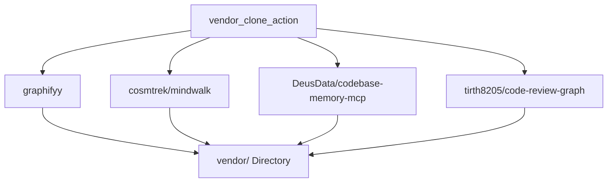

# 3rd-Party Vendor Dependencies & Repository Cloning

## Overview

Documentation of third-party repository dependencies cloned into `vendor/` via `vendor_clone_action` in `src/agy_graphify/tasks.py`.

### Dependency Index

- Navigation: [[Index]]
- Graph Architecture: [[Graph_Architecture]]
- Symbols: [[Symbol_Navigation]]

### Tracked Vendor Repositories

1. **`graphifyy`**: Tree-Sitter code graph extraction engine (`https://github.com/graphifyy/graphifyy.git`).
2. **`cosmtrek/mindwalk`**: Go codebase visual exploration engine (`https://github.com/cosmtrek/mindwalk.git`).
3. **`DeusData/codebase-memory-mcp`**: Model Context Protocol graph memory server (`https://github.com/DeusData/codebase-memory-mcp.git`).
4. **`tirth8205/code-review-graph`**: Automated git review graph parser (`https://github.com/tirth8205/code-review-graph.git`).

## Context

Dependencies are cloned asynchronously using `asyncio.create_subprocess_exec` adhering strictly to the zero shell script policy.
