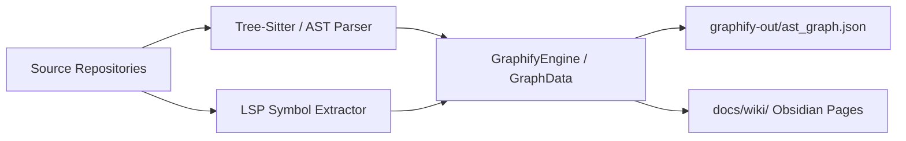

# Graph Architecture & Tree-Sitter AST Indexing

## Overview

This document outlines the Graphify knowledge graph engine architecture, Tree-Sitter AST parser integration, and LSP symbol extraction pipeline.

### Architectural Index

- Main entrypoint: [[Index]]
- Vendor Repositories: [[Dependencies]]
- Symbol Lookup: [[Symbol_Navigation]]

Total Indexed AST Nodes: 1161 (57 files, 1104 symbols)
Total Indexed AST Edges: 1159 (including cross-reference edges)

## Context

Knowledge graph extraction processes local source code in `src/agy_graphify/` and cloned third-party dependencies in `vendor/`. Persistent artifacts are serialized to `graphify-out/graph.json` and `graphify-out/ast_graph.json`.
