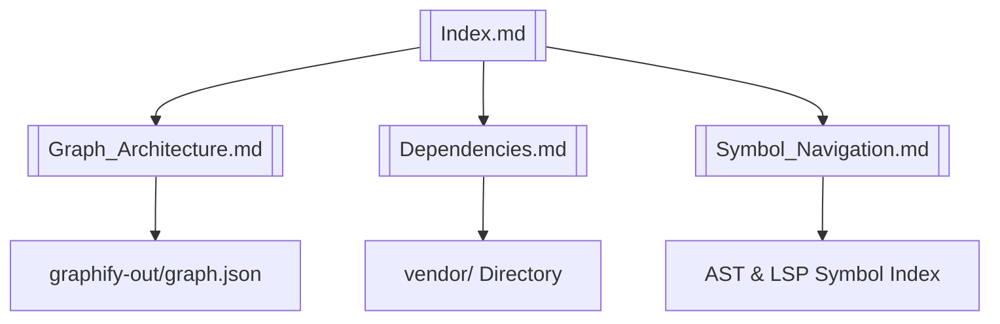

# Wiki Navigation & System Knowledge Index

## Overview

This Obsidian-formatted documentation hub provides a cross-linked knowledge index of `agy-graphify-research` AST graphs, LSP symbols, dependency clones, and system architecture.

### Obsidian Wiki Graph Navigation

- **[[Graph_Architecture]]**: Tree-Sitter AST & LSP symbol extraction pipeline.
- **[[Dependencies]]**: 3rd-party vendor repositories and dependency cloning specifications.
- **[[Symbol_Navigation]]**: Symbol map and location index across core codebase modules.

## Context

The knowledge base is continuously indexed via `graphify_index_action` in `src/agy_graphify/tasks.py`.
