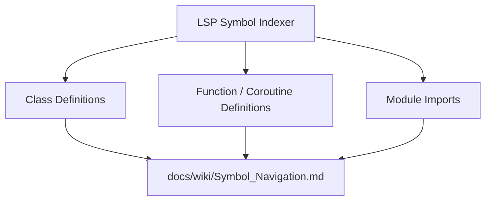

# Symbol Navigation & Codebase Map

## Overview

LSP symbol locations, function signatures, and class definitions parsed across core source code and vendor repositories.

### Related Wiki Documentation

- Main Index: [[Index]]
- Graph Pipeline: [[Graph_Architecture]]
- Vendor Dependencies: [[Dependencies]]

Total Active LSP Symbols Indexed: 143

## Context

Symbols are extracted via `graphify_index_action` in `src/agy_graphify/tasks.py` and exported into `graphify-out/lsp_symbols.json`.
